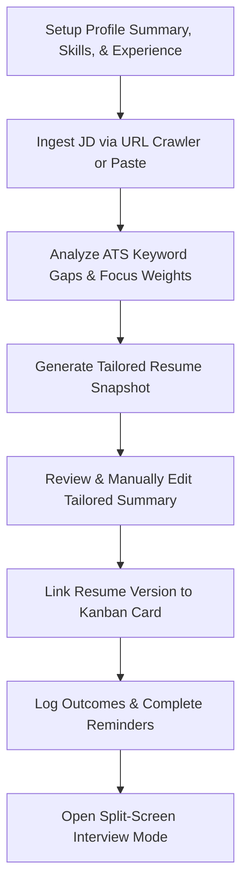
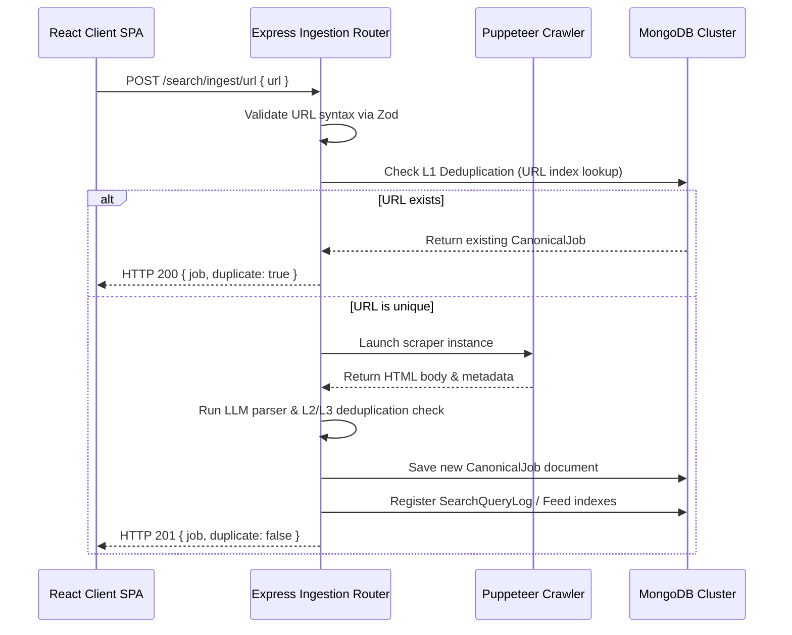

# Case Study: JobTailor — An AI-Assisted Product Case Study on a Developer Productivity Tool

---

## 1. Cover Page

* **Product Name**: JobTailor
* **Subtitle**: Building an Automated Resume Customization Pipeline and Context-Aware Application Ingester for Personal Career Workflows
* **Author**: Chozharajan M
* **Date**: July 2026
* **Document Version**: 1.0.0
* **Target Audience**: Software Engineers, AI Engineers, Founders, and Product Leaders
* **Workspace Reference**: [job-tailor](file:///d:/PROJECT_GIT/JOB%20TAILOR)

---

## 2. Executive Summary

JobTailor is an advanced personal productivity tool and developer cockpit designed to automate and organize the job application lifecycle. It bridges the gap between a candidate's master profile and dynamic job requirements by providing automated resume tailoring, ATS (Applicant Tracking System) scoring, and context-aware job ingestion.

Rather than being designed as an enterprise multi-tenant SaaS platform, JobTailor is structured as a **single-user personal application**. The architecture focuses on developer self-hosting, cost efficiency, and workflow reliability. It features a TypeScript monorepo with an Express server and a React single-page client, powered by a modular AI Provider Manager. The application requires **only one active API key** (such as OpenAI, Google Gemini, or NVIDIA NIM) to function fully; the manager dynamically routes all tasks (JD parsing, resume tailoring, and ATS analysis) to whichever provider key is configured in the environment.

This case study reviews the product design decisions, the software architecture patterns chosen to resolve data integrity issues, the prompt design philosophy, and the trade-offs of building an AI-augmented workspace tool.

---

## 3. Problem Statement

For job applicants, the career search workflow is highly repetitive and inefficient. Candidates face several bottlenecks:
1. **Time-Consuming Customization**: Tailoring professional summaries, picking relevant projects, and aligning experience bullets for every job description takes 30–60 minutes per application.
2. **Opaque Screening**: Candidates submit resumes without knowing how well they align with ATS keywords, leading to high rejection rates.
3. **Fragmented Ingestion**: Job listings are scattered across portals. Copying listings manually results in duplicates, dead links, and lost formatting.
4. **Context Loss during Prep**: Tracking applications on generic boards (like Trello) disconnects the specific resume version and target JD from interview preparation, leading to generic interview answers.

---

## 4. Product Goals

The product goals for JobTailor are scaled specifically for a single-user developer workflow:

```
+-----------------------------------------------------------------------------------+
|                            DEVELOPER WORKFLOW GOALS                               |
+--------------------------+-----------------------------+--------------------------+
|      Local Ingest        |       Keyword Match         |     Contextual Prep       |
+--------------------------+-----------------------------+--------------------------+
| - Crawl job listings via | - Run deterministic keyword | - Centralize application |
|   URLs using Puppeteer   |   matching alongside LLM-   |   outcomes and reminders |
|   or manual paste.       |   driven formatting audits. |   in a Kanban tracker.   |
| - Filter out duplicate   | - Generate tailored resume  | - Provide a split-screen |
|   listings using a       |   snapshots without fabric- |   mock interview view    |
|   3-tier deduplication   |   ating skills.             |   aligned to the JD.     |
|   pipeline.              |                             |                          |
+--------------------------+-----------------------------+--------------------------+
```

---

## 5. User Workflow

The user workflow in JobTailor is designed as a linear pipeline that connects job discovery directly to interview preparation:



1. **Profile Setup**: The user builds their master profile (summary, experiences, projects, education, and certifications) using an interactive dashboard.
2. **Job Ingestion**: The user enters a job description URL or pastes raw text. The backend parses the requirements and checks for duplicates.
3. **Fidelity Analysis**: The system maps the JD's focus distribution (frontend vs. backend weighting) and identifies missing skills.
4. **Tailoring Snapshot**: The user triggers the tailoring engine, which selects relevant projects, reorders resume sections, prioritizes matching experience bullets, and rewrites the summary.
5. **Interactive Summary Refinement**: In the preview card, the user can toggle an inline editor to manually adjust the AI-written summary before saving.
6. **Kanban Application Tracking**: The user moves the application card through tracking columns. Within the detail view, they log reminders and outcome details (rejection reasons, callback dates, and salary offer ranges).
7. **Contextual Interview Practice**: For active interviews, the user opens **Interview Mode** directly from the card. The UI splits, presenting target job bullets on one side and a mock question interface on the other.

---

## 6. AI Workflow

JobTailor utilizes LLM completions and structured outputs to drive the ingestion, tailoring, and scoring engines:

```
+-----------------------------------------------------------------------------------------+
|                                    INGESTION PIPELINE                                   |
|  Unstructured JD text  ===>  LLM Structured Parse (Zod Schema)  ===>  Job Record        |
+-----------------------------------------------------------------------------------------+
|                                     TAILORING PIPELINE                                  |
|  Master Profile + JD   ===>  Deterministic Sorting/Filtering   ===>  LLM Summary Rewrite |
+-----------------------------------------------------------------------------------------+
|                                     ATS SCORING PIPELINE                                |
|  Resume snapshot + JD  ===>  TF-IDF Keyword Score  ===>  LLM Format & Completeness Audit|
+-----------------------------------------------------------------------------------------+
```

### 1. Ingestion Pipeline
When raw JD text or crawled HTML is submitted, the ingestion engine passes the text to the AI Provider Manager. The LLM extracts the job requirements and parses them into a strict schema:
* **Focus weights**: Focus allocation percentages (e.g. `frontend: 10%`, `backend: 80%`, `devops: 10%`, `ai: 0%`, `mobile: 0%`).
* **Required and preferred skills** (e.g. `['Node.js', 'TypeScript', 'Docker']`).
* **Attributes**: Seniority level, tone, qualifications, responsibilities, and nice-to-haves.

### 2. Tailoring Pipeline
The tailoring engine merges the candidate's master profile with the parsed JD:
1. **Section Reordering**: Automatically reorders the resume layout based on the JD's primary focus weights. If the JD is backend-heavy, experience and skills sections are bubbled up.
2. **Experience Bullet Prioritization**: Resume experience bullets are tagged (e.g., `frontend`, `backend`, `devops`). Bullets matching the primary focus area of the JD are sorted to the top. The list is sliced to `maxBulletsPerRole` to keep the resume concise.
3. **Project Filtering**: Candidate projects are scored based on overlap between project tech stack elements and JD skills, selecting the top matches.
4. **Summary Rewriting**: The LLM rewrites the candidate's professional summary, inserting target keywords while keeping the claims strictly grounded in the candidate's actual profile.

### 3. ATS Scoring Pipeline
This pipeline grades the tailored resume snapshot against the job description:
* **Keyword Matching**: A deterministic TF-IDF matcher calculates the exact overlap percentage of required/preferred skills.
* **Semantic Analysis**: The LLM evaluates formatting quality (presence of standard headings, spelling/grammar check) and checks if experience bullets contain measurable metrics (e.g., "improved load times by 40%").
* **Output Generation**: Emits missing/weak skills lists with improvement recommendations.

---

## 7. Prompt Design Philosophy

The prompt design in JobTailor is strictly **deterministic**, **instruction-focused**, and **truth-bounded**. Prompts are configured with low temperatures ($\le 0.2$) to ensure reproducible structures and eliminate LLM hallucinations.

### Example 1: Professional Summary Rewriting Prompt
* **Location**: [resume-tailor.service.ts](file:///d:/PROJECT_GIT/JOB%20TAILOR/apps/server/src/services/resume-tailor.service.ts#L111-L151)
* **Goal**: Rewrite summaries to match target JDs without fabricating facts.

```typescript
const prompt = `CURRENT SUMMARY: ${currentSummary || '(none provided)'}

CANDIDATE PROFILE:
- Skills: ${(profile.skills || []).map((s) => s.name).join(', ')}
- Experience: ${JSON.stringify(profile.experience?.map((e) => `${e.role} at ${e.company}`))}
- Projects: ${JSON.stringify(profile.projects?.map((p) => `${p.name} — ${p.description}`))}

TARGET JOB DESCRIPTION:
- Role: ${jd.summary}
- Required Skills: ${jd.requiredSkills.join(', ')}
- Focus: Backend ${jd.focusWeights.backend}%, Frontend ${jd.focusWeights.frontend}%, DevOps ${jd.focusWeights.devops}%, AI ${jd.focusWeights.ai}%

Rewrite the summary for this specific job.`;

const systemPrompt = `You are an expert resume writer. Rewrite professional summaries to match job descriptions.

Rules:
- Keep it to 2-3 sentences maximum
- Naturally incorporate keywords from the target JD
- Match the tone of the JD (${jd.tone})
- Highlight relevant skills from the candidate's profile
- Do NOT fabricate skills or experience
- Respond with ONLY the rewritten summary text, no quotes or explanation`;
```

### Example 2: ATS Score Grading Prompt
* **Location**: [ats-scoring.service.ts](file:///d:/PROJECT_GIT/JOB%20TAILOR/apps/server/src/services/ats-scoring.service.ts#L170-L220)
* **Goal**: Assess section completeness, formatting quality, and quantitative metrics structure using JSON structured outputs.

```typescript
const systemPrompt = `You are an ATS (Applicant Tracking System) parser. Analyze the resume against the target JD and return a JSON object with scores.

JSON Schema:
{
  "semanticMatchScore": number (0-100, how well experiences match the JD role conceptually),
  "sectionCompletenessScore": number (0-100, based on presence of summary, skills, experience, projects, education),
  "formatScore": number (0-100, deduct points for spelling errors, formatting issues, lack of quantitative metrics),
  "missingSkills": Array of { "skill": string, "required": boolean, "suggestion": string },
  "weakSkills": Array of { "skill": string, "userYearsExp": number, "requiredYearsExp": number, "gap": number, "suggestion": string },
  "actionItems": Array of string (concrete, actionable improvements to increase resume score)
}

Rules:
- Be critical. Good resumes score 75+. Perfect resumes score 90+.
- Check if experience bullets have quantitative metrics (percentages, dollar amounts, time savings). If <50% have them, cap formatScore at 70.
- Do not invent skills. Check the resume content.
- Respond with ONLY the JSON object. No explanation.`;
```

---

## 8. Technical Architecture

JobTailor uses a decoupled monorepo structure. TypeScript types are shared across the client and server to guarantee API contract stability.

```
                  +-----------------------------------------+
                  |            React Client SPA             |
                  |  - Zustand state                        |
                  |  - React Query (cache invalidations)    |
                  |  - TailwindCSS layout                   |
                  +--------------------+--------------------+
                                       | HTTP / REST (JWT)
                                       v
                  +--------------------+--------------------+
                  |       NodeJS / Express Server           |
                  |  - Authentication (silent refresh)      |
                  |  - Zod request validations              |
                  |  - Database models (Mongoose)           |
                  +-------+-------------------------+-------+
                          |                         |
                          v API Calls               v Mongoose Queries
            +-------------+-------------+     +-----+-------------+
            |    AI Provider Manager    |     |   MongoDB Atlas   |
            |  - Fallback pipeline      |     |  - Collections:   |
            |  - Providers:             |     |    Users, Jobs,   |
            |    - OpenAI Adapter       |     |    Resumes,       |
            |    - Gemini Adapter       |     |    Profiles,      |
            |    - NVIDIA NIM Adapter   |     |    Applications   |
            +---------------------------+     +-------------------+
```

### Ingestion Flow Sequence
The sequence below details how crawled job URLs are validated, stored, and indexed by the system:



---

## 9. Engineering Decisions

### 1. Unified AI Provider Manager Adapter Pattern
* **Decision**: Implement a provider-agnostic LLM adapter interface ([provider-manager.ts](file:///d:/PROJECT_GIT/JOB%20TAILOR/apps/server/src/services/ai-provider/provider-manager.ts)).
* **Reasoning**: A single-user tool should not force the user to set up and fund multiple API keys simultaneously. The manager adapts standard OpenAI, Gemini, and NVIDIA NIM SDKs to the same completion and structured output interfaces. This lets the deployer run the entire application using **any single key** they already own (setting `PREFERRED_AI_PROVIDER` to `openai`, `gemini`, or `nvidia`). If multiple keys are provided, it can also act as a dynamic fallback mechanism to bypass vendor outages.
* **Trade-off**: Requires custom JSON sanitization code ([utils.ts](file:///d:/PROJECT_GIT/JOB%20TAILOR/apps/server/src/services/ai-provider/utils.ts)) to parse structured output responses since different provider models format JSON markdown blocks slightly differently.

### 2. Three-Tier Deduplication Hierarchy
* **Decision**: Implement sequential Deduplication (L1: Exact URL -> L2: Normalized metadata metadata -> L3: MinHash text similarity).
* **Reasoning**: Identical jobs are frequently posted across different URLs, and companies post identical job roles with minor text changes. Simply indexing by URL results in duplicates. L2 checks for normalized title, company, and location matches. L3 calculates a Jaccard similarity coefficient using character 3-gram hashes to catch duplicate descriptions.
* **Trade-off**: L3 checks require reading active jobs from the database for text comparisons, increasing database read overhead. This was mitigated by indexing fields and restricting Jaccard checks to jobs matching the same location and company.

### 3. Split JWT Sessions with HttpOnly Refresh Tokens
* **Decision**: Maintain short-lived access tokens in memory and long-lived refresh tokens in secure HttpOnly cookies ([auth.service.ts](file:///d:/PROJECT_GIT/JOB%20TAILOR/apps/server/src/services/auth.service.ts)).
* **Reasoning**: Storing credentials in `localStorage` exposes users to XSS (Cross-Site Scripting) token extraction. Moving the refresh token to a browser-managed, encrypted cookie restricts client access. If the short-lived access token expires, an Axios interceptor triggers a background refresh call (`POST /auth/refresh`).
* **Trade-off**: Requires handling CORS policies carefully when running client and server on separate development ports (`credentials: 'include'`).

---

## 10. AI Tools Used

During the development of JobTailor, construction was accelerated by utilizing agentic AI pair programming workflows, and LLMs were leveraged at runtime to process unstructured text:

| Stage / Component | AI Model / Provider options | Actual Application in JobTailor |
|---|---|---|
| **Development Pair** | Antigravity AI Agent | Monorepo structure setup, Zod routing validations, React components, and Vitest test coverage integration. |
| **All Runtime AI Services** (Parser, Tailor, ATS score) | OpenAI (`gpt-4o-mini`), Google Gemini (`gemini-1.5-flash`), or NVIDIA NIM (`llama-3.1-70b-instruct`) | The user configures **any one** of these providers in their `.env` file to process JD parsing, resume summary generation, and ATS formatting audits. |

---

## 11. Challenges & Solutions

### Challenge 1: Mongoose Concurrency Overwrites (`VersionError`)
* **Context**: When editing profile child elements (e.g. adding a skill while editing an education entry), parallel requests resulted in document version collisions (`VersionError: No document found for query`).
* **Root Cause**: By default, Mongoose saves arrays by replacing the entire array block. If two transactions fetch the parent profile document concurrently, the latter write fails because the document version `__v` has incremented.
* **Solution**: Refactored subdocument writes to use atomic, direct Mongo array operators (`$push`, `$pull`, `$set`) mapped to unique subdocument IDs, rather than executing standard Mongoose `.save()` calls on fetched document trees.

### Challenge 2: Headless Crawler Failures & Link Rot
* **Context**: Crawling company career portals using standard `fetch` failed because modern single-page career pages rely on client-side JS rendering. Additionally, target sites blocked requests due to bot-detection signatures.
* **Solution**: Implemented a fallback crawler architecture using Puppeteer to load page DOM trees, with random User-Agent strings. If a crawl fails, the UI falls back gracefully to a manual copy-paste dialogue.

---

## 12. Product Impact (Truthful Verification)

* **Codebase Stability**: The application is fully typecheck-compliant (`npm run typecheck` resolves cleanly with 0 errors).
* **Test Coverage**: Realized **50 passing integration tests** across the client and server. Tests validate registration, token refresh, duplicate detection, profile CRUD concurrency, ATS calculations, and outcome tracking.
* **Zero Halucinations**: The resume generation engine ensures that skills, experiences, and projects are strictly selected and reordered from existing user inputs. Summaries are rewritten using only confirmed candidate attributes.
* **Robust Session Management**: When a session expires, the browser displays a secure overlay prompt to re-authenticate, safeguarding the user's workspace progress.

---

## 13. Future Improvements

To transition JobTailor from an advanced MVP into a production SaaS product, we recommend the following backlog enhancements:

1. **Local MongoDB Database Mocking**: Migrate tests to run against an in-memory database instance (`mongodb-memory-server`) to eliminate network dependencies and latency during integration test runs.
2. **Deep Semantic Synonyms Mapping**: Integrate vectors and cosine similarity using pgvector or MongoDB Vector Search to evaluate skill gaps dynamically (e.g., matching "React.js" to "frontend web frameworks").
3. **Advanced PDF Render Engine**: Implement a headless Chrome-based HTML-to-PDF print layout service to replace simple browser printing, ensuring highly styled resume template layouts.

---

## 14. Lessons Learned

1. **API Contracts Must Be Frozen Early**: Sharing a common type library (`@jobtailor/shared-types`) between the Express API schemas and React components prevents type drifts and build-time breakages.
2. **LLMs Are Adapters, Not Core Logic**: AI is a pipeline component, not the system architecture. Surrounding LLM calls with deterministic validations, fallbacks, and schema parsing ensures the system remains robust.
3. **Write Path Atomicity is Key**: When designing document-based database models (like MongoDB) that support nested arrays, use atomic database-level operations (`$push`, `$set`) early on to avoid concurrent save collisions.

---

## 15. Appendix

### Main Database Model Schemas

#### 1. User Model Schema ([User.model.ts](file:///d:/PROJECT_GIT/JOB%20TAILOR/apps/server/src/models/User.model.ts))
```typescript
const UserSchema = new Schema<IUser>({
  email: { type: String, required: true, unique: true, lowercase: true, trim: true },
  passwordHash: { type: String, required: true },
  firstName: { type: String, required: true },
  lastName: { type: String, required: true },
  createdAt: { type: Date, default: Date.now },
});
```

#### 2. Profile Model Schema ([Profile.model.ts](file:///d:/PROJECT_GIT/JOB%20TAILOR/apps/server/src/models/Profile.model.ts))
```typescript
const ProfileSchema = new Schema<IProfile>({
  userId: { type: Schema.Types.ObjectId, ref: 'User', required: true, unique: true },
  summary: { type: String, default: '' },
  skills: [{
    name: { type: String, required: true },
    category: { type: String, required: true },
    yearsOfExperience: { type: Number, required: true },
    proficiency: { type: String, enum: ['beginner', 'intermediate', 'expert'], required: true },
    isHighlighted: { type: Boolean, default: false }
  }],
  experience: [{
    company: { type: String, required: true },
    role: { type: String, required: true },
    location: { type: String },
    startDate: { type: String, required: true },
    endDate: { type: String },
    current: { type: Boolean, default: false },
    bullets: [{
      text: { type: String, required: true },
      tags: [{ type: String }]
    }]
  }],
  projects: [{
    name: { type: String, required: true },
    description: { type: String, required: true },
    techStack: [{ type: String }],
    highlights: [{ type: String }],
    url: { type: String }
  }],
  education: [{
    institution: { type: String, required: true },
    degree: { type: String, required: true },
    fieldOfStudy: { type: String, required: true },
    startYear: { type: Number, required: true },
    endYear: { type: Number },
    grade: { type: String }
  }],
  certifications: [{
    name: { type: String, required: true },
    issuer: { type: String, required: true },
    issueDate: { type: String, required: true },
    expiryDate: { type: String },
    credentialId: { type: String },
    url: { type: String }
  }],
  links: {
    github: { type: String },
    linkedin: { type: String },
    portfolio: { type: String },
    website: { type: String }
  }
});
```
