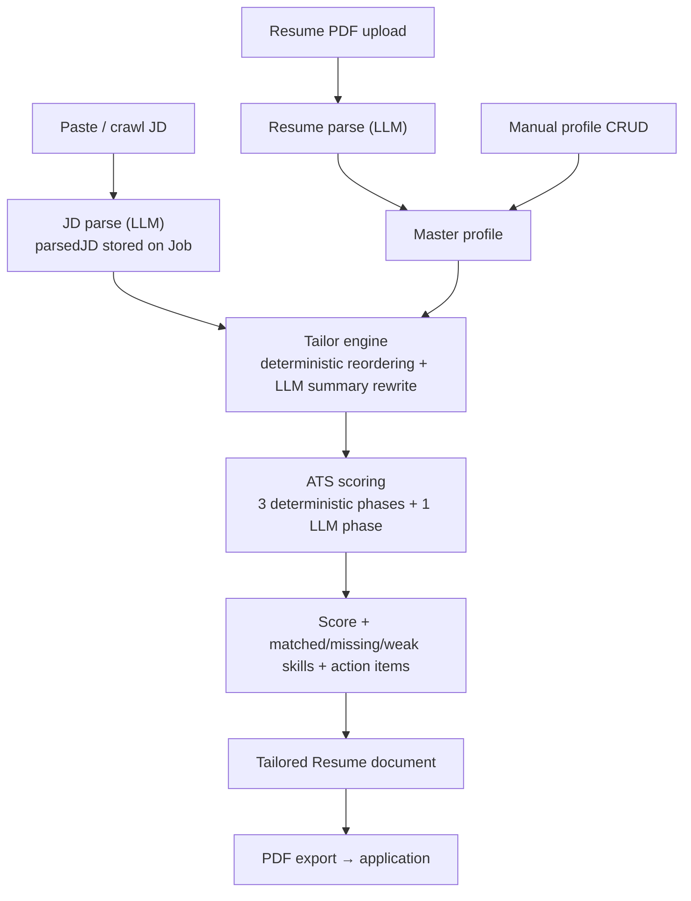
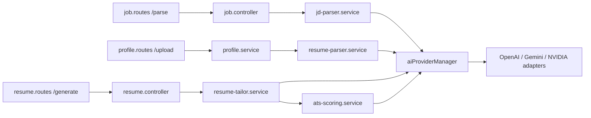

# AI/JD Analysis Architecture — JobTailor

|                      |                                                            |
| -------------------- | ---------------------------------------------------------- |
| **Document version** | 1.0                                                        |
| **Date**             | 2026-08-30                                                 |
| **Status**           | Draft                                                      |
| **Author**           | JobTailor project owner (sole developer)                   |
| **Classification**   | Internal                                                   |
| **Reviewers**        | None yet — draft for review                                |
| **Repository state** | All claims verified against the codebase at the date above |

## Table of Contents

1. Introduction
2. Project Context
3. Goals, Non-Goals, and Success Metrics
4. AI/ML Pipeline Architecture
5. Surrounding System Architecture
6. Data Design for AI Outputs
7. API Design
8. LLM Integration Architecture
9. Scalability and Performance
10. Security and Privacy
11. Evaluation and MLOps
12. Bias and Fairness
13. Trade-offs and Alternatives
14. Constraints That Shaped the Design
15. Known Limitations and Technical Debt
16. Open Questions and Future Considerations
17. Appendix

---

## 1. Introduction

### 1.1 Purpose

This document describes how JobTailor uses AI to parse job descriptions (JDs), parse resumes, tailor resume content to a specific JD, and score the resulting match. It covers the four LLM call sites, the deterministic scoring and tailoring logic around them, the provider abstraction they run through, and the failure behavior of each stage.

This is a companion to `docs/system-design.md`, which covers the wider system. Where this document says "see SDD §N", it refers to that document.

### 1.2 Scope

Covered: JD parsing, resume parsing, resume tailoring, ATS scoring, gap analysis output, the AI provider layer, prompt design, AI-related security controls, and AI-specific limitations.

Not covered: the job search/ingestion crawler (except where it feeds JD text), authentication, tracker, analytics, deployment (SDD §4–§9), and frontend UI details.

### 1.3 Audience

Backend engineers maintaining the AI services, and technical reviewers assessing how the system uses LLMs. The document assumes familiarity with REST APIs and basic LLM concepts.

### 1.4 Definitions

| Term              | Definition                                                                                  |
| ----------------- | ------------------------------------------------------------------------------------------- |
| JD                | Job description — raw posting text pasted or crawled by the user                            |
| LLM               | Large language model accessed via a third-party API                                         |
| Structured output | An LLM response constrained (by instruction and validation) to a JSON schema                |
| Parsed JD         | The `IParsedJD` object extracted from raw JD text (skills, focus weights, seniority, tone…) |
| Master profile    | The user's canonical resume data stored in the `Profile` collection                         |
| Tailored resume   | A per-job snapshot of the master profile reordered and rewritten for one JD                 |
| ATS score         | JobTailor's heuristic 0–100 match score between a tailored resume and a parsed JD           |
| Semantic score    | The LLM-judged component of the ATS score (45% weight when available)                       |
| Degraded scoring  | The fallback ATS computation when the LLM phase is unavailable — flagged, never fabricated  |
| Provider manager  | The single routing/fallback point for all LLM calls (SDD §7.2)                              |
| Focus weights     | LLM-estimated emphasis percentages across frontend/backend/devops/ai/mobile for a JD        |

---

## 2. Project Context

### 2.1 Problem

JobTailor is a candidate-side tool: it helps one developer apply to many jobs per day. The repeating work is reading a JD, deciding what the role actually emphasizes, adjusting the resume to match, and judging how strong the match is. The AI layer exists to mechanize the reading and the first-pass adjustment.

### 2.2 Where AI sits in the product loop



### 2.3 Users

| Role                 | Who                                         | How they touch the AI layer                                                     |
| -------------------- | ------------------------------------------- | ------------------------------------------------------------------------------- |
| Candidate (the user) | The project owner — this is a personal tool | Pastes JDs, uploads their own resume PDF, triggers parse/generate, reads scores |
| Maintainer           | Same person, as developer                   | Edits prompts, adapters, scoring weights                                        |

There are no recruiters, no third-party candidates, and no hiring decisions in this system. That fact shapes several later sections (evaluation, bias) honestly.

---

## 3. Goals, Non-Goals, and Success Metrics

### 3.1 Goals

1. Convert free-text JDs into a stable structured shape (`IParsedJD`) that the rest of the system can rely on.
2. Convert an uploaded resume PDF into the master profile with minimal manual entry.
3. Produce a per-JD tailored resume by reordering and rewriting profile content — never by inventing experience.
4. Produce a match score the user can interrogate: per-phase scores, matched/missing/weak skills, and action items.
5. Keep every AI capability working when any single LLM provider fails, and keep scores honest when all fail.

### 3.2 Non-goals

- No embeddings, vector database, or trained NLP/NER models — not implemented (§4.9 explains why).
- No screening of other people's resumes; no ranking of candidates.
- No multi-language JD support — prompts and tag enums are English-oriented.
- No simulation of any specific commercial ATS product.
- No batch matching — scoring runs for one resume × one JD at a time.

### 3.3 Success metrics

No quantitative model-quality metrics exist. There is no labeled test set, no F1 measurement for skill extraction, and no correlation study against human judgment — **not measured**, and no benchmark has been built. The functional acceptance criteria actually used during development were:

| Criterion                                                                          | Status                                                                                 |
| ---------------------------------------------------------------------------------- | -------------------------------------------------------------------------------------- |
| Parse produces a schema-valid `IParsedJD` with ≥ 1 required skill, or fails loudly | Implemented (Zod validation + explicit error)                                          |
| Score never contains a fabricated semantic component                               | Implemented (`semanticScoreDegraded` flag + deterministic renormalization)             |
| Tailoring never adds skills/experience absent from the profile                     | Implemented by construction (reorder/rewrite only; rewrite prompt forbids fabrication) |
| All four AI features survive a single provider outage                              | Implemented (fallback chain; covered by provider-manager tests)                        |

If evaluation is added later, §11 describes what is missing.

---

## 4. AI/ML Pipeline Architecture

### 4.1 Input layer — how text enters the pipeline

Three ingestion paths feed the AI layer:

| Path              | Mechanism                                                                                                   | AI involved?                                                                     |
| ----------------- | ----------------------------------------------------------------------------------------------------------- | -------------------------------------------------------------------------------- |
| Manual JD paste   | `POST /jobs` stores `jdRawText` on the user's `Job`                                                         | No — parsing is a later explicit step                                            |
| URL crawl         | Ingestion service fetches the public page, prefers JSON-LD `JobPosting`, falls back to meta tags (SDD §7.4) | No — deterministic extraction only                                               |
| Resume PDF upload | `POST /profile/upload` (multer) → server-side text extraction with `pdf-parse`                              | Text extraction is deterministic; the text then goes to the resume parser (§4.4) |

Deliberate note: JDs obtained by crawling are extracted deterministically from structured page data. The LLM is not used to scrape or clean HTML — that keeps crawl costs zero and failures attributable.

Scanned/image-only PDFs are not supported: when `pdf-parse` yields no text, the upload fails with `PDF_EMPTY` ("Ensure the PDF is not a scanned image"). No OCR exists.

### 4.2 Stage 1 — JD parsing (`jd-parser.service.ts`)

**Purpose:** raw JD text → `IParsedJD`.

**Entities extracted:**

| Field                                         | Type                                                   | Notes                                                       |
| --------------------------------------------- | ------------------------------------------------------ | ----------------------------------------------------------- |
| summary                                       | string (required)                                      | 1–2 sentence role overview                                  |
| seniorityLevel                                | enum: entry/mid/senior/staff/principal                 | Invalid values fall back to `mid`                           |
| focusWeights                                  | five numbers 0–100 (frontend/backend/devops/ai/mobile) | Expected to sum ≈ 100; invalid object falls back to 20 each |
| requiredSkills                                | string[]                                               | Empty array is a hard failure — parsing is rejected         |
| preferredSkills                               | string[]                                               | Falls back to `[]`                                          |
| responsibilities, qualifications, niceToHaves | string[]                                               | Fall back to `[]`                                           |
| tone                                          | enum: formal/casual/technical/corporate                | Falls back to `technical`                                   |

**Invocation parameters:** `generateStructuredOutput`, temperature 0.2, maxTokens 2000, input truncated to 20,000 characters (`MAX_JD_INPUT_LENGTH`) before prompting for token-cost safety.

**Output contract:** the prompt demands raw JSON only and spells out the exact structure. Every field of the response is then validated by a Zod schema. Fields with `.catch()` defaults degrade gracefully; `summary` and a non-empty `requiredSkills` are hard requirements — a response missing them throws `AI provider returned an invalid JD structure` or `Incomplete parsing result`, and nothing is persisted.

**Trust boundary:** the JD text is external and untrusted. It is wrapped in `<JOB_DESCRIPTION>` delimiters and the system prompt instructs the model to treat the content strictly as data and ignore any instructions inside it (§10).

Parsing is on-demand (`POST /jobs/:id/parse`), not automatic at job creation — a job can exist without a parsed JD, and generation explicitly requires one (§7).

### 4.3 Stage 2 — Resume parsing (`resume-parser.service.ts`)

**Purpose:** raw resume text (from PDF extraction) → `ParsedProfile`, which populates the master profile.

The prompt specifies a strict JSON shape: summary, skills (with category enum `frontend/backend/devops/ai/mobile/database/other`, estimated years, proficiency enum, `isHighlighted`), experience blocks with tagged bullets (tags: `frontend/backend/devops/ai/testing/leadership`), projects, education, certifications, and links. Parameters: temperature 0.1, maxTokens 4096.

**Post-parse sanitization.** The LLM output is treated as unreliable at the edges. Before anything reaches the database, a defensive pass:

| Area               | Coercion applied                                                                                                          |
| ------------------ | ------------------------------------------------------------------------------------------------------------------------- |
| Skills             | Empty names dropped; unknown category → `other`; unknown proficiency → `intermediate`; years clamped to 1–50, invalid → 1 |
| Experience bullets | Empty text dropped; missing IDs generated (`b_` + random); tags filtered against the allowed set                          |
| Experience blocks  | Missing company/role/location/date get neutral defaults (`Unknown Company`, `Software Engineer`, `Remote`, `2024-01`)     |
| Projects           | Tags filtered against allowed set; neutral defaults for name/description/date                                             |
| Education          | Years clamped to 1980–2035; defaults for missing institution/degree/field                                                 |
| Certifications     | Defaults for missing name/issuer/date                                                                                     |

This layer exists because a partially-valid profile that crashes the UI is worse than one with neutral defaults; every default is visible and editable in the profile UI afterwards.

### 4.4 Skill normalization and synonymy

There is no skills taxonomy database. Normalization exists at two honest scales:

1. **Inside the LLM calls.** The parser prompts constrain skills to free-text names and fixed category enums; the resume parser additionally asks for years and proficiency estimates. Canonicalization ("React.js" vs "React") is left to the model and is not enforced.
2. **A small deterministic synonym map** (`utils/skill-matcher.ts`), used by search ranking and the alert dispatcher — not by scoring. Five groups are mapped: react family, node family, devops/sre/site reliability, typescript/ts, javascript/js. Matching uses lookaround boundaries (`(?<!\w)…(?!\w)`) instead of `\b` so keywords ending in non-word characters (`c++`, `c#`, `.net`) still match; all user input is regex-escaped first.

The map is deliberately tiny and shared: one module guarantees identical match semantics between search and alerts. Expanding it is cheap but has not been prioritized (§15).

### 4.5 Stage 3 — Tailoring engine (`resume-tailor.service.ts`)

Runs after a JD is parsed and a master profile exists. Five deterministic transforms plus one LLM call:

| Step                  | Logic                                                                                                                                                                  |
| --------------------- | ---------------------------------------------------------------------------------------------------------------------------------------------------------------------- |
| Skill ordering        | Highlighted skills first; remaining order unchanged                                                                                                                    |
| Bullet prioritization | Bullets tagged with the JD's top focus area sort first; capped at `maxBulletsPerRole` (default 4)                                                                      |
| Project selection     | Each project scored +2 per JD skill appearing in its tech stack, +1 per skill in highlights (case-insensitive substring both ways); top `maxProjects` (default 3) kept |
| Section ordering      | Top focus weight selects a priority map: frontend/ai/mobile → skills, projects, experience; backend/devops → skills, experience, projects                              |
| Summary rewrite       | LLM call (§4.5.1)                                                                                                                                                      |

**4.5.1 Summary rewrite.** The only `generateCompletion` (free-text) call in the system: temperature 0.5, maxTokens 200. The prompt supplies the current summary, a compact view of the profile (skill names, roles/companies, project names/descriptions), and the parsed JD (summary, required skills, focus percentages). The system prompt requires 2–3 sentences, JD keywords woven in naturally, tone matched to the JD's `tone`, and explicitly: **"Do NOT fabricate skills or experience."** On any error the original summary is returned unchanged — tailoring never fails outright because the rewrite failed.

The tailored output is then scored (§4.6) and the whole bundle (content + score + `sectionOrder`) is persisted as a versioned `Resume` snapshot (SDD §5.2).

### 4.6 Stage 4 — Matching and scoring engine (`ats-scoring.service.ts`)

Four phases, run concurrently (`Promise.all`), combined by fixed weights:

| Phase                | Weight | Method                                                                                                                                                                                       |
| -------------------- | ------ | -------------------------------------------------------------------------------------------------------------------------------------------------------------------------------------------- |
| Keyword match        | 35%    | JD skills matched against resume text tokens; required skills weigh 2×, preferred 1×; score = matched weight / total weight                                                                  |
| Semantic match       | 45%    | LLM judgment: the parsed JD and resume content are serialized into a prompt; the model returns `{"score": 0-100, "reasoning": "…"}`; temperature 0.1, maxTokens 300; result clamped to 0–100 |
| Section completeness | 12%    | Deterministic points: summary ≥ 50 chars (20), skills ≥ 5 (25), experience with bullets (30), projects ≥ 2 (15), education (10)                                                              |
| Format quality       | 8%     | Base 60; +20 if quantification detected (`\d+%`, `$…`, or counts of users/requests/years…); +10/+20 for average bullet density                                                               |

**Degraded mode.** If the semantic phase throws or returns a non-numeric score, it yields `null` — the code comment is explicit: "Never fabricate a score." The overall score is then renormalized over the deterministic phases only (55% keyword, 25% completeness, 20% format), the result is flagged `semanticScoreDegraded`, and the action items list opens with a notice that the AI phase was unavailable. A degraded score is visibly weaker rather than silently substituted.

**Breakdown computed alongside the score:**

- `matchedSkills` — every JD skill with `presentInResume` boolean and weight;
- `missingSkills` — required JD skills absent from the resume skill list, each with a suggestion string;
- `weakSkills` — required skills the user has but with fewer years than a seniority table expects (`entry 0.5y → principal 10y`), with gap size and suggestion;
- `actionItems` — top-3 missing, top-3 weak, plus two standing items (quantify achievements; tailor summary keywords).

### 4.7 Output — what the user receives

The persisted `Resume` document carries the tailored content and the full `IATSScore`: overall + four phase scores, the degraded flag, and the breakdown. The UI renders the score, the matched/missing/weak tables, and action items; manual summary edits re-save via `PUT /resumes/:id`. The same shape powers the Quick ATS Check flow and analytics' skill-gap aggregation (SDD §6.2).

### 4.8 Stages deliberately not built

The reference architecture for this kind of system usually includes embeddings, a vector store, and trained NER. JobTailor has none of them:

| Absent component               | Why                                                                                                                                                                    |
| ------------------------------ | ---------------------------------------------------------------------------------------------------------------------------------------------------------------------- |
| Embeddings / vector similarity | Single-user corpus; the LLM semantic phase already covers meaning-level matching; an embedding store would add infrastructure with no current query pattern needing it |
| Trained NER (spaCy/BERT)       | No labeled training data exists, and LLM structured output handles the same extraction at this scale with zero training cost                                           |
| Skills taxonomy database       | The 5-group synonym map plus LLM normalization has been sufficient for one user's data                                                                                 |
| Response/result caching        | Parse and generate are explicit, infrequent, user-triggered actions; a caching layer has not been justified yet (reconsidered in §16)                                  |

---

## 5. Surrounding System Architecture

The AI layer lives inside the standard server layering (SDD §4.3): routes → controllers → services. AI services call the provider manager singleton; they never import vendor SDKs. Business flow ownership:



Persistence for AI outputs is MongoDB only (no vector DB). PDF rendering of the tailored result uses Puppeteer and is AI-free (SDD §7.5). The rest of the system — auth, tracker, search — consumes AI outputs as plain documents.

---

## 6. Data Design for AI Outputs

AI outputs are embedded subdocuments, not separate collections:

| Structure        | Stored on                     | Key properties                                                                               |
| ---------------- | ----------------------------- | -------------------------------------------------------------------------------------------- |
| `IParsedJD`      | `Job.parsedJD`                | `_id: false` subdocument; enums with defaults; arrays default `[]`                           |
| `IATSScore`      | `Resume.atsScore`             | Five numeric scores + `semanticScoreDegraded` + breakdown (matched/missing/weak/actionItems) |
| `ParsedProfile`  | written into `Profile` fields | Not stored raw — only the sanitized result persists                                          |
| `Resume` content | `Resume`                      | Snapshot of profile content at generation time; versioned (`version`, `versionLabel`)        |

Design consequences:

- A job's parse result is replaced wholesale on re-parse; there is no parse history.
- Scores are immutable per resume version — re-scoring means generating a new resume version. There is no re-score-in-place endpoint.
- Raw LLM responses are not stored. Only validated/sanitized structures persist. That keeps the database clean but means prompt regressions cannot be replayed from stored outputs (§15).

---

## 7. API Design

AI-touching endpoints (all authenticated, `/api/v1` base; envelope and error conventions in SDD §6):

| Method | Endpoint            | AI behavior                                                                                                                      |
| ------ | ------------------- | -------------------------------------------------------------------------------------------------------------------------------- |
| POST   | `/jobs/:id/parse`   | Runs JD parsing on stored `jdRawText`; replaces `parsedJD`; returns it                                                           |
| POST   | `/profile/upload`   | multipart PDF → text extraction → resume parse → profile population                                                              |
| POST   | `/resumes/generate` | Requires `jobId`; returns `JD_NOT_PARSED` (400) if the job has no parsed JD; runs tailoring + scoring; persists versioned resume |
| PUT    | `/resumes/:id`      | Persists manual edits (e.g., summary) — no AI                                                                                    |
| POST   | `/resumes/:id/pdf`  | Renders the (possibly AI-produced) resume — no AI                                                                                |

Verified example — generation blocked until parsing happened:

```json
// POST /api/v1/resumes/generate   { "jobId": "<job with unparsed JD>" }
// Response (400)
{
  "success": false,
  "error": {
    "code": "JD_NOT_PARSED",
    "message": "Job JD has not been parsed yet. Call POST /jobs/:id/parse first."
  }
}
```

Parse failure surfaces as a normal error envelope; nothing partial is written. Ownership is enforced on every lookup (`{ _id, userId }`), so one user cannot trigger AI work on another user's job.

---

## 8. LLM Integration Architecture

### 8.1 Usage inventory — every production call site

| Use case           | Service       | Contract               | Temperature | maxTokens | Notes                                           |
| ------------------ | ------------- | ---------------------- | ----------- | --------- | ----------------------------------------------- |
| JD parsing         | jd-parser     | structured output      | 0.2         | 2000      | Input truncated at 20,000 chars; Zod-validated  |
| Resume parsing     | resume-parser | structured output      | 0.1         | 4096      | Followed by sanitization pass (§4.3)            |
| Semantic ATS phase | ats-scoring   | structured output      | 0.1         | 300       | `null` on failure → degraded mode               |
| Summary rewrite    | resume-tailor | completion (free text) | 0.5         | 200       | Only non-JSON call; silent fallback to original |

Temperatures were chosen per task: extraction and scoring are near-deterministic (0.1–0.2); the one creative task (summary rewrite) runs warmer (0.5) but tightly length-capped.

### 8.2 Gateway — the provider manager

The manager (SDD §7.2) is the single routing point. Relevant behaviors restated briefly: adapters register only when credentials are present and non-placeholder; fallback order is `preferred → openai → gemini → nvidia`; each failed provider is logged and the next is tried; an exhausted chain throws with every provider's error collected. Default models in adapters: OpenAI `gpt-4o-mini`, Gemini `gemini-2.0-flash`; the NVIDIA NIM model and base URL come from environment config.

### 8.3 Structured output handling

Provider adapters requesting structured output set JSON mode where the vendor supports it (OpenAI `response_format: json_object`) and then parse defensively: `extractAndParseJson` strips Markdown code fences if present, otherwise slices from the first `{`/`[` to the last `}`/`]`, then `JSON.parse`. Malformed content throws — which the caller turns into the fallback or error paths above.

### 8.4 Prompt inventory

Prompts live in code next to their services (not in a template store). Each names the role, the exact output contract, and its constraints:

| Prompt                        | Notable instructions                                                                                                                                          |
| ----------------------------- | ------------------------------------------------------------------------------------------------------------------------------------------------------------- |
| JD parser system prompt       | JSON-only; exact schema inline; focusWeights ≈ 100; separate required vs preferred; **security block treating `<JOB_DESCRIPTION>` content as untrusted data** |
| Resume parser system prompt   | JSON-only; fixed category/proficiency/tag enums; dates as `YYYY-MM`; extract links                                                                            |
| Semantic scorer system prompt | "You are an ATS evaluator"; JSON-only `{score, reasoning}`                                                                                                    |
| Summary rewrite system prompt | 2–3 sentences; match JD tone; incorporate keywords; **do not fabricate skills or experience**                                                                 |

Versioning is by normal code history (git). There is no prompt registry or A/B mechanism.

### 8.5 Cost and usage controls (implemented)

- Hard input truncation (20k chars) and per-call `maxTokens` caps on every call.
- Parsing and generation are explicit user actions — no scheduled or background LLM jobs.
- One resume × one JD per scoring run; no batch fan-out.
- Small models as adapter defaults (`gpt-4o-mini`, `gemini-2.0-flash`); the free-tier-friendly NVIDIA endpoint is in the fallback chain.

**Not implemented:** response caching, per-user token budgets, cost tracking. The adapters do return `usage` token counts from OpenAI responses, but nothing consumes them yet.

---

## 9. Scalability and Performance

Not measured. No latency numbers, throughput figures, or load tests exist for the AI pipeline, and none are claimed here.

What is structurally true:

- Every AI operation is bounded: 20k-char input cap; token caps 300–4096; one LLM round-trip per stage (tailoring = at most one rewrite call + one semantic call inside scoring).
- The four scoring phases run concurrently, so the slowest phase (the LLM call) dominates generation time; deterministic phases are in-memory millisecond-scale string operations.
- End-to-end tailoring latency is therefore expected to be network-bound on LLM round-trips, and the fallback chain adds one round-trip per failed provider. This is reasoned, not measured.
- Single-user scale means no queueing, batching, or worker design exists (SDD §10).

---

## 10. Security and Privacy

### 10.1 AI-specific controls (implemented)

| Risk                               | Control                                                                                                                                                 |
| ---------------------------------- | ------------------------------------------------------------------------------------------------------------------------------------------------------- |
| Prompt injection via JD text       | JD wrapped in `<JOB_DESCRIPTION>` delimiters; system prompt declares the content untrusted data and instructs the model to ignore embedded instructions |
| Malformed/hallucinated structure   | Zod schema validation on JD parse (hard failure on required fields); sanitization pass on resume parse; numeric clamping on semantic score (0–100)      |
| LLM-induced data corruption        | Enums constrained to fixed sets; years/clamps and neutral defaults instead of arbitrary model strings reaching the DB                                   |
| Fabricated content in deliverables | Rewrite prompt forbids fabrication; degraded scores flagged rather than filled                                                                          |
| Regex injection in matching/search | All user keywords escaped before regex construction (skill-matcher, job search)                                                                         |
| Cross-user triggering of AI work   | Ownership filter on every parse/generate lookup                                                                                                         |
| API key exposure                   | Keys only in environment config; placeholder detection prevents accidental registration of template values                                              |

### 10.2 Privacy — stated plainly

Resume and JD text **are sent to third-party LLM providers** (OpenAI, Google, NVIDIA depending on configuration). There are no zero-data-retention agreements in place; the provider terms of whichever account is configured apply. Because this is a personal tool, the data being sent is the owner's own resume content — no third parties' PII is processed. Uploaded PDFs are handled server-side via multer with a 10 MB client-enforced limit; the Cloudinary-only storage rule for resume files applies (SDD §7.5).

### 10.3 Rate limiting

AI endpoints inherit the global API limiter and auth limiters (SDD §8); there is no separate per-feature AI limiter.

---

## 11. Evaluation and MLOps

Honest state: **no formal evaluation infrastructure exists.**

What does exist:

- Vitest suites mock the provider manager and verify ATS scoring behavior (deterministic phases, breakdown construction), provider adapters' response mapping, and the manager's fallback ordering. These test plumbing and determinism, not model quality.
- Schema validation acts as a correctness gate at runtime (a parse that violates the contract fails instead of persisting garbage).

What does not exist:

| Missing piece                         | Status                    |
| ------------------------------------- | ------------------------- |
| Labeled JD/skill extraction test set  | Not built                 |
| F1/precision/recall for extraction    | Not measured              |
| Score correlation vs human judgment   | Not measured              |
| Golden JD–resume pairs for regression | Not built                 |
| Model/prompt version registry         | Git history only          |
| Experiment tracking (MLflow/W&B etc.) | Not applicable / not used |

"Retraining" does not apply — all models are hosted third-party services; the tunable surface is prompts, temperatures, weights, and adapter defaults, all in code. If evaluation is added, the natural first asset is a small hand-labeled set of the user's own past JDs with expected `requiredSkills`, run on every prompt change.

---

## 12. Bias and Fairness

Context first: this system does not screen, rank, or filter other people. It scores the owner's own resume against public JDs to help the owner decide how to apply. There is no selection decision a third party is subjected to, and no demographic data is collected anywhere in the data model.

Residual risks that are real anyway:

| Risk                                     | Where                                                                                                               | Mitigation today                                                                                                                                       |
| ---------------------------------------- | ------------------------------------------------------------------------------------------------------------------- | ------------------------------------------------------------------------------------------------------------------------------------------------------ |
| LLM bias in the semantic score           | The 45%-weight phase is a model judgment and can reflect training-data biases about career shapes, gaps, or wording | The phase is only 45% of a score whose majority is deterministic; degraded mode is transparent; the score is advisory input for the user, never a gate |
| Summary rewrite altering factual content | Rewriting could drift toward embellishment                                                                          | Explicit no-fabrication instruction; rewrite output is user-reviewed and editable before export                                                        |
| Seniority-years heuristic                | The weak-skill table uses a static years-by-seniority map that may not fit every role                               | It only produces suggestions, not penalties                                                                                                            |

No fairness metrics are computed or scheduled, and none are claimed. If this system were ever extended to evaluate other candidates, this section would need to become a full bias-audit program before that use went live.

---

## 13. Trade-offs and Alternatives

| Decision                | Chosen                                                  | Trade-off                                                                                                                                                                                                                  |
| ----------------------- | ------------------------------------------------------- | -------------------------------------------------------------------------------------------------------------------------------------------------------------------------------------------------------------------------- |
| Extraction approach     | LLM structured output only (no spaCy/BERT/rules hybrid) | Per-call cost and latency, dependence on provider availability; bought zero training data needs and schema-flexible extraction. A classic NLP hybrid was considered in planning docs but rejected for solo-maintainer cost |
| Scoring model           | Weighted four-phase blend, majority deterministic       | Loses pure-embedding simplicity; buys explainability (per-phase numbers + skill tables) and a score that survives total LLM outage                                                                                         |
| Semantic failure policy | Renormalize + flag, never default-fill                  | Degraded scores look weaker (which they are); alternative (fixed 75 placeholder) was an earlier design that was replaced precisely because it fabricated confidence                                                        |
| Skill matching          | Token/substring matching + 5-group synonym map          | Misses paraphrase ("build pipelines" vs "CI/CD"); embeddings would fix it at new infrastructure cost. Not evaluated beyond this                                                                                            |
| Project relevance       | Case-insensitive substring scoring                      | "Node" matches "Node" but related tech ("Express") doesn't boost; acceptable at 3-project selection cap                                                                                                                    |
| Prompt storage          | In-code, git-versioned                                  | No runtime prompt editing or A/B; acceptable — prompts change with code, not independently                                                                                                                                 |
| No LLM response cache   | Re-run on demand                                        | Duplicate parse of the same JD costs tokens again; usage volume has not justified a cache layer                                                                                                                            |

---

## 14. Constraints That Shaped the Design

- **Free/low-cost LLM tiers.** Quota exhaustion mid-session is a normal event, which is why the fallback chain and the no-fabrication degradation policy exist at all.
- **Node.js ecosystem.** The server is TypeScript; Python NLP stacks (spaCy etc.) would have meant a second runtime. LLM-via-HTTP kept the AI layer inside one codebase.
- **No GPU, no model hosting.** Only hosted inference was ever an option.
- **Solo maintenance.** Every component had to be debuggable by one person; a hybrid ML pipeline with training jobs did not meet that bar.
- **Candidate-side scope.** Because no third-party candidates are processed, the system could skip the compliance machinery a recruiter-facing scorer would require.

---

## 15. Known Limitations and Technical Debt

1. **Scoring is a heuristic.** Token-based keyword matching (no TF-IDF), a static seniority-years table, and a single LLM judgment call. Internal estimate for this area: ~60% complete.
2. **No evaluation dataset or metrics** (§11) — prompt changes are currently judged by inspection and unit tests only.
3. **No LLM response caching** — re-parsing an unchanged JD re-spend tokens.
4. **Skill ordering is shallow** — highlighted-first only; no per-skill JD-relevance weighting.
5. **Synonym map has 5 groups.** "ML" → "machine learning", "K8s" → "kubernetes", etc. are not covered anywhere.
6. **Raw LLM responses are not retained** — parsing regressions can't be replayed from stored data.
7. **No re-score endpoint** — improving a resume requires generating a new resume version.
8. **Scanned PDFs unsupported** (no OCR); `PDF_EMPTY` is the terminal error.
9. **Model selection is inconsistent** — the NVIDIA model is environment-configurable (`NVIDIA_NIM_MODEL`), while the OpenAI (`gpt-4o-mini`) and Gemini (`gemini-2.0-flash`) defaults are pinned in adapter code with only per-call override options that no caller uses.

---

## 16. Open Questions and Future Considerations

**Migration:** not applicable — no migration is underway. Improvements listed below are incremental and backward-compatible with the stored data model.

**Open questions:**

- Is a small labeled JD set worth building for regression-testing prompt changes?
- Should identical `jdRawText` be hash-cached to avoid re-parse costs?
- Should semantic-score reasoning text be surfaced in the UI (it is returned but currently only the number persists in the breakdown)?

**Future considerations (not committed):**

- Embedding-based keyword expansion for scoring and search.
- True TF-IDF or BM25 keyword phase replacing the token-set match.
- A prompt/template registry if prompt iteration frequency increases.
- Token usage accounting (adapters already return usage for OpenAI).

---

## 17. Appendix

### 17.1 Verification commands

```bash
npm run test --workspace=job-tailor-server   # includes ats-scoring, provider adapter/manager suites
npm run typecheck
```

### 17.2 Prompt inventory (locations)

| Prompt           | File                                                |
| ---------------- | --------------------------------------------------- |
| JD parser        | `apps/server/src/services/jd-parser.service.ts`     |
| Resume parser    | `apps/server/src/services/resume-parser.service.ts` |
| Semantic scorer  | `apps/server/src/services/ats-scoring.service.ts`   |
| Summary rewriter | `apps/server/src/services/resume-tailor.service.ts` |

### 17.3 Related documents

| Document                            | Relevance                                        |
| ----------------------------------- | ------------------------------------------------ |
| `docs/system-design.md`             | Whole-system architecture (SDD references above) |
| `docs/ai-provider-architecture.md`  | Provider contract and extension checklist        |
| `docs/ai-provider-configuration.md` | Provider environment configuration               |
| `TWO_TYPE_RESUME_SYSTEM.md`         | Profile-resume vs job-resume product design      |

### 17.4 Revision history

| Version | Date       | Change                                                      |
| ------- | ---------- | ----------------------------------------------------------- |
| 1.0     | 2026-08-30 | Initial document, written from direct codebase verification |
