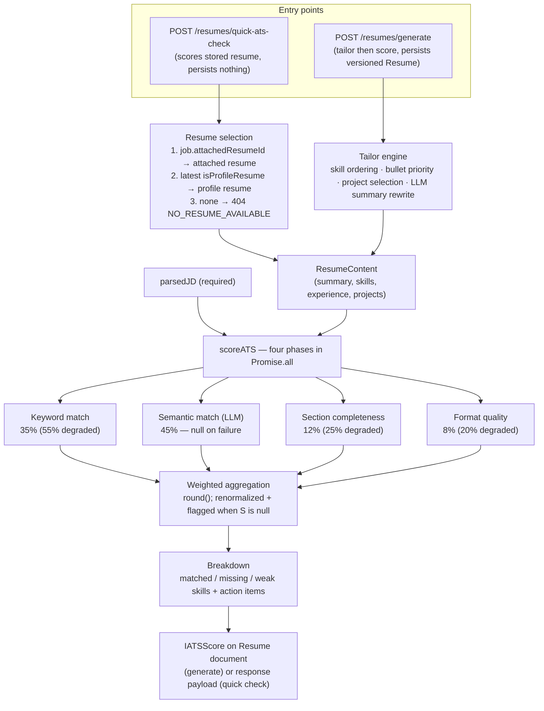

# ATS Scoring Engine — Technical Design Document

|                    |                                                                                                                                                                                                                              |
| ------------------ | ---------------------------------------------------------------------------------------------------------------------------------------------------------------------------------------------------------------------------- |
| **Document title** | ATS Scoring Engine — Technical Design Document                                                                                                                                                                               |
| **Subtitle**       | JobTailor                                                                                                                                                                                                                    |
| **Version**        | 1.1                                                                                                                                                                                                                          |
| **Author**         | JobTailor project owner (sole developer)                                                                                                                                                                                     |
| **Date**           | 2026-08-30                                                                                                                                                                                                                   |
| **Status**         | Draft                                                                                                                                                                                                                        |
| **Reviewers**      | None yet — draft for review                                                                                                                                                                                                  |
| **Classification** | Internal                                                                                                                                                                                                                     |
| **Change log**     | v1.1 — 2026-09-27 — Keyword phase v2 (synonyms, graded credit, IDF), score cache, rescore endpoint, engineVersion + degraded-flag persistence · v1.0 — 2026-08-30 — Initial draft, written from direct codebase verification |

## Table of Contents

1. Introduction
2. Project Overview and Business Context
3. Goals, Non-Goals, and Success Metrics
4. Scoring Algorithm Design
5. Resume Parsing Pipeline
6. JD Parsing Pipeline
7. Matching Engine Architecture
8. Ranking and Filtering
9. Score Explainability
10. Configurability
11. Data Design
12. API Design
13. Infrastructure and Performance
14. Fairness, Bias, and Compliance
15. Testing Strategy
16. Trade-offs and Alternatives
17. Migration and Timeline
18. Open Questions and Future Work
19. Appendix

---

## 1. Introduction

### 1.1 Purpose

This document is the engineering blueprint for JobTailor's ATS scoring engine: the component that scores a resume against a parsed job description (JD) on a 0–100 scale and explains the result as matched, missing, and weak skills plus action items. It defines the exact formula, each scoring phase, failure behavior, storage, API surface, and tests.

### 1.2 Scope

Covered: the scoring formula and its four phases, the gap-analysis output, degraded (LLM-unavailable) behavior, the two scoring entry points (full generation and quick check), persistence of scores, explainability surfaces, and the test suite.

Resume parsing and JD parsing are covered at the interface level only; their internals live in `docs/ai-jd-analysis-architecture.md`. The wider system (auth, tracker, search) is in `docs/system-design.md` (referenced as "SDD").

### 1.3 Audience

Backend engineers maintaining the scoring service, QA engineers designing tests around it, and technical reviewers assessing how the score is produced and how honest it is when the AI layer fails.

### 1.4 Definitions

| Term              | Definition                                                                                  |
| ----------------- | ------------------------------------------------------------------------------------------- |
| ATS score         | JobTailor's 0–100 heuristic match score for one resume × one parsed JD                      |
| Scoring dimension | One of the four phases: keyword match, semantic match, section completeness, format quality |
| Weight            | Fixed multiplier applied to a dimension (0.35 / 0.45 / 0.12 / 0.08)                         |
| Degraded scoring  | The fallback computation used when the LLM semantic phase fails; flagged, never fabricated  |
| Breakdown         | The explainability payload: matchedSkills, missingSkills, weakSkills, actionItems           |
| Weak skill        | A required JD skill the resume has, but with fewer years than the seniority table expects   |
| Profile resume    | The user's master resume (`isProfileResume: true`), as opposed to a job-tailored version    |

---

## 2. Project Overview and Business Context

### 2.1 Problem and positioning

JobTailor is a **candidate-side** tool: one developer scoring their own resume against jobs they intend to apply to. This inverts the usual ATS framing — there is no recruiter, no candidate pool, no ranking of people against each other. The score answers "how well does my resume speak this JD's language, and what should I fix before applying?", not "should this person be interviewed?"

That positioning is the single most important design constraint in this document: it removes the need for ranking, knockouts, anti-gaming, and compliance machinery (§4.7, §8, §14), and it makes explainability the primary product value — the user acts on the breakdown, not the number.

### 2.2 Approach in industry context

| Generation | Approach                                                                         | Where JobTailor sits                                                                      |
| ---------- | -------------------------------------------------------------------------------- | ----------------------------------------------------------------------------------------- |
| Gen 1      | Exact keyword counts                                                             | Our keyword phase is a weighted token match (required 2×, preferred 1×) — Gen 1/2 lineage |
| Gen 2      | Weighted keywords                                                                | Same                                                                                      |
| Gen 3      | NLP entity extraction + embeddings                                               | Not used — no embeddings or trained NER exist (§4.7)                                      |
| Gen 4      | LLM-augmented                                                                    | Our semantic phase is a single LLM judgment call per scoring run                          |
| **Ours**   | Hybrid: weighted keywords + LLM semantic + deterministic structure/format phases | Chosen for explainability and free-tier cost (§16)                                        |

### 2.3 User stories (as implemented)

| As a…      | I want to…                                                | So that…                                               |
| ---------- | --------------------------------------------------------- | ------------------------------------------------------ |
| Candidate  | See a 0–100 score with per-phase numbers                  | I can compare resume versions for one job              |
| Candidate  | See exactly which required skills are missing             | I know what to add or address before applying          |
| Candidate  | Get a quick score without generating a new resume version | I can sanity-check a job before investing in tailoring |
| Candidate  | See the score on my tracker cards                         | I can prioritize which applications to follow up       |
| Maintainer | Run the scoring phases without a live LLM in tests        | The deterministic math stays regression-tested         |

---

## 3. Goals, Non-Goals, and Success Metrics

### 3.1 Goals

1. Produce a reproducible, bounded 0–100 score for any resume × parsed-JD pair.
2. Make every point of the score traceable: four named phase scores plus a skill-level breakdown.
3. Survive total LLM outage without emitting a fake number (§4.5).
4. Run the four phases concurrently so scoring latency is one LLM round-trip, not four sequential steps.
5. Store the score immutably per resume version so past applications keep the score they were made with.

### 3.2 Non-goals

- No hiring decisions, no candidate ranking, no auto-reject/auto-advance thresholds.
- No knockout criteria, no anti-gaming detection, no bonus/penalty multipliers (§4.7 explains why these are absent rather than merely deferred).
- No configurable weights (§10).
- No batch scoring — one pair per call.
- No claim of simulating any specific commercial ATS product.

### 3.3 Success metrics

No quantitative quality metrics exist. There is no labeled gold set, no correlation study against human judgment, and no latency benchmark — **not measured**. The acceptance criteria actually enforced are behavioral and covered by tests (§15):

| Criterion                                                           | Status                                                         |
| ------------------------------------------------------------------- | -------------------------------------------------------------- |
| Score always within 0–100, including out-of-range LLM replies       | Implemented + tested (clamp test)                              |
| Keyword phase weights required skills 2× preferred                  | Implemented + tested (exact-value test)                        |
| Missing required skills always surfaced in breakdown                | Implemented + tested                                           |
| LLM failure never fabricates a semantic score                       | Implemented + tested (degraded test)                           |
| Deterministic phases produce identical results for identical inputs | True by construction (pure functions); not separately asserted |

---

## 4. Scoring Algorithm Design

### 4.1 Philosophy

1. **Multi-dimensional** — four independent phases, each stored separately.
2. **Weighted** — fixed weights, summing to 1.0.
3. **Explainable** — the breakdown lists per-skill evidence, not just a number.
4. **Honest under failure** — a failed AI phase degrades the score visibly instead of substituting a confident fake.
5. **Bounded** — every phase is clamped to 0–100 before weighting; the final score is rounded to an integer.
6. **Not configurable** — deliberate, see §10.

### 4.2 Master formula

```text
ATS_Score = round( Keyword×0.35 + Semantic×0.45 + Completeness×0.12 + Format×0.08 )

When the semantic phase is unavailable:
ATS_Score = round( Keyword×0.55 + Completeness×0.25 + Format×0.20 )
            and semanticScoreDegraded = true
```

All dimension scores are integers 0–100. There are no penalty or bonus multipliers.

Engine version: every score is stamped `engineVersion` (2 since the 2026-09 upgrade; scores stored before the field existed are v1). The weights above are identical across both versions — only the keyword phase's matching method changed (§4.3).

### 4.3 Dimension 1 — Keyword match (35%)

Method (engine v2, `keyword-scorer.ts`): the resume is split into 4 section texts (summary, skill names, experience bullets, project tech stacks + highlights). Each JD skill (required + preferred) is graded:

| Credit | Match type   | Rule                                                                           |
| ------ | ------------ | ------------------------------------------------------------------------------ |
| 1.0    | exact        | bounded case-insensitive regex `(?<!\w)skill(?!\w)` hits the full resume text  |
| 0.9    | synonym      | the shared `skill-matcher.ts` synonym groups (react/node/devops-sre/ts/js) hit |
| 0.75   | token-subset | multi-word skill: all tokens (>2 chars) appear in the resume token set         |
| 0      | none         | —                                                                              |

A skill appearing in 2+ of the 4 sections earns a +0.1 spread bonus (credit capped at 1.0). Weights remain required = 2, preferred = 1, optionally scaled by a per-skill IDF factor (§4.3.1).

```text
Keyword_Score = round( Σ(effectiveWeight × credit) / Σ(effectiveWeight) × 100 )   (0 when no skills listed)
```

Worked example from the golden fixtures (`src/tests/fixtures/ats-golden-cases.json`): resume says "React.js"/"TS", JD requires `[React, TypeScript]` → React exact 1.0 (spread-capped), TypeScript synonym 0.9 → (2×1.0 + 2×0.9)/4 = **95** (v1 scored this 50 — it missed "TS" for "TypeScript"; the v1 token-set matcher is preserved in the golden file as recorded delta history).

#### 4.3.1 IDF distinctiveness weighting

`skill-idf.service.ts` computes `idf(skill) = ln(1 + N/(1+df))` over the newest ≤500 `CanonicalJob` descriptions (df counted with synonym expansion), normalized so the rarest requested skill = 1. `effectiveWeight = weight × idfNorm`. The corpus is cached in-process for 1 hour; an empty corpus, a missing DB connection, or any error yields an empty map and plain weights — scoring never fails because IDF failed. Effect: distinctive skills ("Kubernetes") outweigh ubiquitous ones ("communication") once the live-discovery index has content.

Historical note (v1, replaced 2026-09-27): matching was token-set based with a substring fallback and no synonym handling; the synonym map existed in the search feature only.

### 4.4 Dimension 2 — Semantic match (45%)

One LLM structured-output call: the parsed JD and the resume content are JSON-serialized into the prompt; the system prompt is "You are an ATS evaluator. Score resumes against job descriptions on a scale of 0-100" with a JSON-only `{"score", "reasoning"}` contract. Temperature 0.1, maxTokens 300. The returned number is clamped to 0–100; a non-finite value or any exception yields `null` — the code comment is explicit: _never fabricate a score_. `null` triggers degraded mode (§4.5). The `reasoning` string is returned by the provider call but is not persisted.

### 4.5 Dimension 3 — Section completeness (12%)

Deterministic point table, max 100:

| Component  | Points | Rule                                                          |
| ---------- | ------ | ------------------------------------------------------------- |
| Summary    | 20     | ≥ 50 chars → 20; non-empty → 10                               |
| Skills     | 25     | ≥ 5 → 25; ≥ 3 → 15; ≥ 1 → 5                                   |
| Experience | 30     | ≥ 1 role and every role has bullets → 30; otherwise 15        |
| Projects   | 15     | ≥ 2 → 15; 1 → 8                                               |
| Education  | 10     | Flat — assumed present because it lives in the master profile |

### 4.6 Dimension 4 — Format quality (8%)

| Component               | Points    | Rule                                                                               |
| ----------------------- | --------- | ---------------------------------------------------------------------------------- |
| Base                    | 60        | Any content present                                                                |
| Quantified achievements | +20       | Bullets match `\d+%`, `$…`, or counts of users/requests/team/projects/months/years |
| Bullet density          | +20 / +10 | Average bullets per role ≥ 4 / ≥ 2                                                 |

Capped at 100.

### 4.7 Degraded mode and the no-fabrication rule

If the semantic phase yields `null`, the overall score is renormalized over the three deterministic phases (55/25/20), `semanticMatchScore` is stored as 0, `semanticScoreDegraded` is set, and the action items list is prefixed with: "Semantic (AI) scoring was unavailable — this score reflects keyword, completeness and format analysis only. Re-run later for a full evaluation."

Design history, for honesty's sake: the May-2026 architecture snapshot in this repository described a fixed fallback semantic score of 75. That placeholder was replaced by the renormalize-and-flag policy, because a constant standing in for a missing AI judgment presents false confidence — exactly what a scoring tool must not do. The degraded score is visibly weaker, and says so.

### 4.8 Breakdown — gap analysis

Computed alongside the score, from the resume's declared skills against the parsed JD:

- **matchedSkills** — every JD skill with `presentInResume` and weight (required 2 / preferred 1).
- **missingSkills** — required JD skills absent from the resume skill list; each carries a suggestion ("Consider adding X experience or a relevant project…").
- **weakSkills** — required skills present but with fewer years than a static seniority table expects: entry 0.5y, mid 2y, senior 5y, staff 8y, principal 10y (default 2). Gap is rounded to 0.1; suggestions differ for <1y vs. experienced-but-short.
- **actionItems** — top-3 missing, top-3 weak, plus two standing items ("Quantify achievements with metrics where possible", "Tailor summary to use JD-specific keywords"), plus the degraded notice when applicable.

### 4.9 What this engine deliberately does not have

The reference architecture for ATS scoring includes knockout criteria, anti-gaming detection (keyword stuffing, hidden text), bonus/penalty multipliers, and candidate ranking. None exist here, and none are silently "deferred": they protect a recruiter evaluating strangers' resumes. Our user scores their own resume — keyword stuffing against oneself is not a threat model, knockouts would only block the user's own view, and there is no pool to rank. If this engine were ever repurposed to score third-party candidates, this section becomes a mandatory design workstream before use.

---

## 5. Resume Parsing Pipeline

Interface level only (internals in the AI/JD doc §4.3–4.4). The scoring engine consumes a `ResumeContent` shape: `summary`, `skills` (name/category/years/proficiency), `experience` (company + bullets), `projects` (name/techStack/highlights). Two producers feed it:

1. **Tailored resume generation** — the tailor service reorders the master profile against the parsed JD and passes the tailored snapshot to scoring (§7).
2. **Quick ATS check** — passes an existing stored resume (attached or profile resume) as-is (§7, §12).

Resume text enters the system either as PDF upload → `pdf-parse` extraction → LLM parser → sanitized master profile, or as manual profile CRUD. Scanned-image PDFs fail with `PDF_EMPTY` before any scoring is possible.

---

## 6. JD Parsing Pipeline

Interface level only (AI/JD doc §4.2). Scoring requires a parsed JD (`IParsedJD`): summary, seniorityLevel, focusWeights, requiredSkills, preferredSkills, responsibilities, qualifications, niceToHaves, tone. A job without `parsedJD` cannot be scored — both entry points return `JD_NOT_PARSED` (400). Parsing is on-demand (`POST /jobs/:id/parse`), Zod-validated, and rejects results with zero required skills.

---

## 7. Matching Engine Architecture



Concurrency note: the four phases run in `Promise.all`, so end-to-end scoring cost is dominated by the single LLM round-trip; the three deterministic phases are in-memory string operations.

---

## 8. Ranking and Filtering

Not applicable as designed: the engine scores one resume against one JD; there is no candidate pool, no ranked list, no buckets, no thresholds that trigger automated actions.

What exists instead, at the product layer:

- **Version comparison** — multiple `Resume` versions can exist per job; each carries its own `atsScore`, so the user can compare "which version scored better."
- **Tracker badges** — the Kanban tracker renders the stored overall score with three visual bands: ≥ 75 (green), 50–74 (yellow), < 50 (red). These are display thresholds only; they gate nothing.
- **Analytics aggregation** — the analytics service aggregates matched/gap skill frequencies across scored resumes for the skill-gap report (SDD §6.2).

---

## 9. Score Explainability

Every score ships with its evidence, at three surfaces:

| Surface                      | Content shown                                                                                                                       |
| ---------------------------- | ----------------------------------------------------------------------------------------------------------------------------------- |
| Resume Tailor page           | Overall + four phase scores; matched/missing/weak skill tables with suggestions; action items; editable summary to act on them      |
| Quick ATS modal (Jobs page)  | Overall + keyword score, matched/missing skill lists, and which resume source was used (attached vs profile) with its version label |
| Tracker cards / detail modal | Overall score badge in the three visual bands (§8)                                                                                  |

Explainability levels beyond this (recruiter-facing summaries, compliance audit trails, candidate-facing rewrites) do not exist — the single user is both audience and subject.

The degraded notice (§4.7) is itself an explainability feature: it tells the user which phases the number is made of.

---

## 10. Configurability

**None.** Weights, the seniority-years table, the completeness point table, and the format rules are constants in `ats-scoring.service.ts`. There is no config hierarchy, no per-job overrides, no preset templates, and no scoring-mode switch (quick/standard/deep).

Rationale: for a personal tool with one user, configurability would add a settings surface, a config-snapshot requirement for score comparability, and validation logic — all to tune numbers whose calibration has never been measured (§3.3). Hardcoded constants keep every stored score comparable to every other. If calibration data ever exists (§18), weights become the first configurable item.

---

## 11. Data Design

Scores are embedded, not relational:

- `Resume.atsScore` — an `_id: false` Mongoose subdocument: `overallScore`, `keywordMatchScore`, `semanticMatchScore`, `sectionCompletenessScore`, `formatScore`, optional `semanticScoreDegraded`, optional `engineVersion` (2 for scores produced since the 2026-09 upgrade; absent = v1), and `breakdown { matchedSkills[], missingSkills[], weakSkills[], actionItems[] }`.
- Persistence fix (2026-09-27): `semanticScoreDegraded` existed in the TypeScript interface but was missing from the Mongoose schema, so strict mode stripped it on every save. Both it and `engineVersion` are now declared in `atsSchema` and survive a round-trip (regression-tested in `ats-schema-persist.test.ts`).
- The v1→v2 behavior delta is recorded permanently in the golden fixture `src/tests/fixtures/ats-golden-cases.json` (case B keyword 50→95, case C 0→100, cases A/D unchanged).
- There is **no separate scoring_results table and no scoring audit log**. The score lives on the resume version it describes; re-scoring means generating a new version. Consequence: score history across versions exists (one score per version), but the inputs and config at scoring time are not snapshotted beyond the resume content itself.
- Raw LLM replies (including the semantic `reasoning` text) are not persisted.
- Indexes relevant to score consumers: `Resume (userId, jobId)` and `(userId, isProfileResume)`; the tracker reads scores via populated `Application.resumeId`.

Design consequence worth knowing before modifying: because the score is immutable per version, changing the weights in code makes old stored scores incomparable with new ones. There is no re-score-in-place endpoint; a migration story would need one (§18).

---

## 12. API Design

Two authenticated endpoints invoke scoring (envelope and error conventions in SDD §6):

| Method | Endpoint                   | Behavior                                                                                                                                                                                                                                               |
| ------ | -------------------------- | ------------------------------------------------------------------------------------------------------------------------------------------------------------------------------------------------------------------------------------------------------ |
| POST   | `/resumes/generate`        | Requires `jobId` with `parsedJD` (else 400 `JD_NOT_PARSED`); tailors the master profile, scores, persists a versioned `Resume` with `atsScore`                                                                                                         |
| POST   | `/resumes/quick-ats-check` | Body `{ jobId }` (Zod-validated); scores without persisting; resume selection: attached resume → latest profile resume → 404 `NO_RESUME_AVAILABLE` with a suggestion string                                                                            |
| POST   | `/resumes/:id/rescore`     | Re-runs the current engine on the resume's stored content + its job's parsedJD; returns `{ stored, fresh, delta, overwritten: false }`; **never writes** to the resume. Errors: `RESUME_NOT_FOUND` (404), `JOB_NOT_FOUND` (404), `JD_NOT_PARSED` (400) |

Verified quick-check response (200):

```json
{
  "success": true,
  "data": {
    "atsScore": {
      "overallScore": 78,
      "keywordMatchScore": 80,
      "semanticMatchScore": 81,
      "sectionCompletenessScore": 85,
      "formatScore": 80,
      "breakdown": {
        "matchedSkills": [
          { "skill": "React", "presentInResume": true, "weight": 2 }
        ],
        "missingSkills": [],
        "weakSkills": [],
        "actionItems": ["Quantify achievements with metrics where possible"]
      }
    },
    "resumeSource": "profile",
    "resumeId": "…",
    "resumeVersionLabel": "…",
    "pdfUrl": null,
    "message": "ATS score calculated using your profile-based master resume"
  }
}
```

Error paths verified in the controller: `MISSING_JOB_ID` (400), `JOB_NOT_FOUND` (404, ownership-checked), `JD_NOT_PARSED` (400), `NO_RESUME_AVAILABLE` (404), `INTERNAL_ERROR` (500).

---

## 13. Infrastructure and Performance

Not measured — no latency benchmarks, throughput figures, or SLAs exist, and none are claimed.

Structural facts:

- Scoring performs exactly one LLM call (the semantic phase) per run; the other three phases are pure in-memory computation. The phases run concurrently, so wall-clock time ≈ one LLM round-trip plus provider-fallback retries on failure.
- Score caching (2026-09-27): `quick-ats-check` reads/writes an in-process LRU cache (`score-cache.ts`, 200 entries, 1-hour TTL) keyed on sha256 of the deterministic serialization of (resume content, parsed JD, engine version) — a new engine version can never serve an old score. Degraded results are never cached, so a retry after provider recovery re-runs the full pipeline. `generateResume` bypasses the cache (tailored content is new per call); `rescore` bypasses the read but writes through. Single-instance deployment means no Redis; a restart starts cold. LLM responses themselves are still not cached, and the semantic phase may vary between providers or model versions — so "100% reproducibility" remains **not** a property of the engine and is not claimed.
- Single server instance, single user (SDD §10). No queue, no workers, no GPU.

---

## 14. Fairness, Bias, and Compliance

Context determines the section's shape: this engine scores the owner's own resume. It never receives, stores, or processes another person's data; no demographic fields exist anywhere in the data model (no name, gender, age, photo, or institution-tier inputs to scoring — the completeness phase grants education points flatly, without evaluating institution or degree level).

Residual risks that are nonetheless real:

| Risk                           | Where                                                                                                 | Mitigation today                                                                                                                |
| ------------------------------ | ----------------------------------------------------------------------------------------------------- | ------------------------------------------------------------------------------------------------------------------------------- |
| LLM bias in the semantic phase | The 45% phase is a model judgment and can reflect training-data biases about career shapes or wording | Majority of the score is deterministic; degraded mode is transparent; the score advises the user, it never gates another person |
| Seniority-years heuristic      | Static table maps seniority labels to years, which may misread non-linear careers                     | Produces suggestions only, never disqualification                                                                               |
| Keyword-phase narrowness       | Token matching can under-credit paraphrased experience                                                | The semantic phase and the missing-skill suggestions exist precisely to surface, not hide, those gaps                           |

No adverse-impact testing, no bias audits, no compliance regime (EEOC, NYC LL144, EU AI Act) applies to self-scoring, and none is claimed. Section 4.9 states the condition under which this section would have to become a full compliance program.

---

## 15. Testing Strategy

The suite mocks **only at the provider boundary** — `aiProviderManager.generateStructuredOutput` — so the scoring mathematics run for real. Five behaviors are asserted (`apps/server/src/tests/ats-scoring.test.ts`):

| Test                               | Asserts                                                                                                                |
| ---------------------------------- | ---------------------------------------------------------------------------------------------------------------------- |
| Weighted score with live LLM phase | Overall within 0–100; semantic = mocked value; all phase scores > 0; not degraded                                      |
| Keyword weighting                  | Exact value 80 for 2 matched required (2×) + 1 unmatched preferred                                                     |
| Missing-skill breakdown            | `Kubernetes` flagged missing, `React` not                                                                              |
| Degraded mode                      | Provider rejection → `semanticScoreDegraded: true`, semantic 0, overall > 0, first action item mentions unavailability |
| Clamping                           | LLM score 999 → semantic 100                                                                                           |

Provider adapters and the fallback manager have their own suites (AI/JD doc §11).

Not present, stated plainly: no accuracy benchmark against a gold set, no bias tests, no anti-gaming tests (no gaming surface), no score-drift regression harness, no performance tests. The deterministic phases are pure functions, so a golden-score regression file would be cheap to add and is the natural next test asset (§18).

---

## 16. Trade-offs and Alternatives

| Decision                  | Chosen                               | Alternative                                      | Trade-off                                                                                        |
| ------------------------- | ------------------------------------ | ------------------------------------------------ | ------------------------------------------------------------------------------------------------ |
| Semantic phase            | Single LLM judgment (45%)            | Embedding cosine similarity                      | No vector infrastructure; but the phase is provider-dependent and not reproducible across models |
| Degraded policy           | Renormalize + flag                   | Fixed placeholder (an earlier iteration used 75) | Weaker-looking scores when AI is down; bought zero fabricated confidence                         |
| Weights                   | Hardcoded constants                  | Configurable per job                             | Scores always comparable; tuning impossible until calibration data exists                        |
| Keyword matching          | Token set + substring, 2×/1× weights | TF-IDF / synonym expansion                       | Simple and predictable; misses paraphrase (synonyms exist only in search, not scoring)           |
| Score storage             | Embedded subdocument on Resume       | Separate scoring_results collection              | Immutability per version for free; no independent audit trail or re-score history                |
| Rounding                  | Integer overall score                | 1-decimal                                        | Matches the UI's band display; loses 0.1 granularity nobody consumes                             |
| Education in completeness | Flat 10 points                       | Evaluated degree/field match                     | Avoids institution/degree bias at the cost of discrimination power                               |

---

## 17. Migration and Timeline

Not applicable — no migration is underway and no staged rollout is planned. Score-affecting changes so far have shipped as code changes with new tests (the placeholder-to-degraded-mode change being the notable one); stored historical scores were accepted as historical rather than recomputed.

---

## 18. Open Questions and Future Work

**Open questions:**

- Should the semantic `reasoning` text be persisted and surfaced? It is produced today and discarded.
- If weights ever become configurable, what snapshot format keeps old scores interpretable?

**Implemented since v1.0 (2026-09-27, formerly listed here as future work):**

- Keyword phase v2: synonym-aware graded credit sharing the search feature's `skill-matcher.ts`, plus IDF distinctiveness weighting from the CanonicalJob corpus (§4.3).
- Golden-score regression file for the deterministic phases (`ats-golden-cases.json` + `ats-golden.test.ts`).
- Score caching keyed on (resume content, parsed JD, engine version) hash (§13).
- Re-score endpoint comparing new engine output against stored versions without overwriting (§12).

**Future considerations (not committed):**

- Calibration study against the user's own application outcomes (interview rate per score band) — the one dataset this product could ethically build.

---

## 19. Appendix

### 19.1 Verification commands

```bash
npm run test --workspace=job-tailor-server   # includes the five ATS scoring tests
npm run typecheck
```

### 19.2 Source locations

| Component                                    | File                                                                                   |
| -------------------------------------------- | -------------------------------------------------------------------------------------- |
| Scoring service (formula, phases, breakdown) | `apps/server/src/services/ats-scoring.service.ts`                                      |
| Scoring tests                                | `apps/server/src/tests/ats-scoring.test.ts`                                            |
| Score schema                                 | `apps/server/src/models/Resume.model.ts` (`IATSScore`)                                 |
| Entry points                                 | `apps/server/src/controllers/resume.controller.ts` (`generateResume`, `quickATSCheck`) |
| Routes                                       | `apps/server/src/routes/resume.routes.ts`                                              |
| UI surfaces                                  | `ResumeTailorPage.tsx`, `JobsPage.tsx` (quick modal), `TrackerPage.tsx` (badges)       |

### 19.3 Related documents

| Document                              | Relevance                                                           |
| ------------------------------------- | ------------------------------------------------------------------- |
| `docs/ai-jd-analysis-architecture.md` | JD/resume parsing internals, provider layer                         |
| `docs/system-design.md`               | Whole-system architecture, data model, API conventions              |
| `docs/architecture.md` (2026-05-14)   | Historical snapshot; documents the since-replaced 75-point fallback |

### 19.4 Revision history

| Version | Date       | Change                                                                                                                    |
| ------- | ---------- | ------------------------------------------------------------------------------------------------------------------------- |
| 1.0     | 2026-08-30 | Initial draft, written from direct codebase verification                                                                  |
| 1.1     | 2026-09-27 | Keyword phase v2 (synonyms, graded credit, IDF), score cache, rescore endpoint, engineVersion + degraded-flag persistence |
