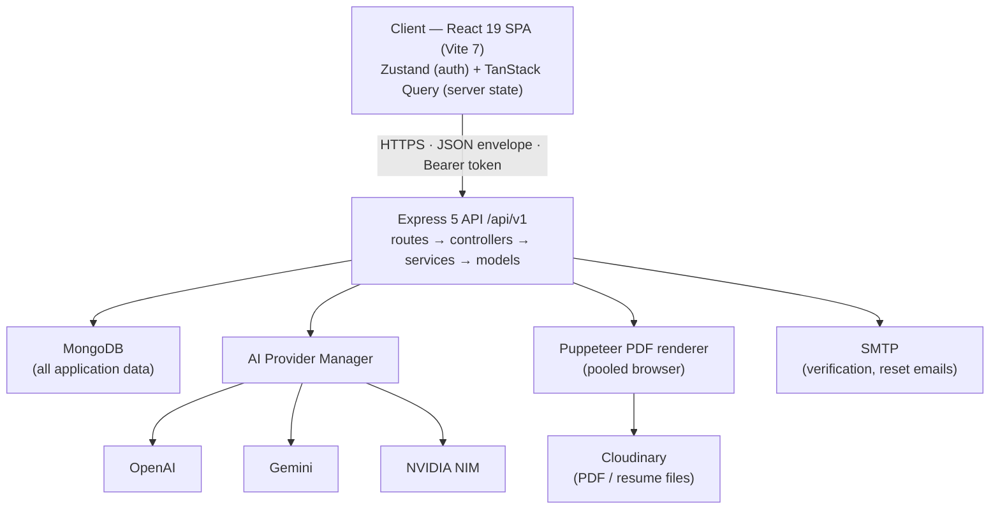
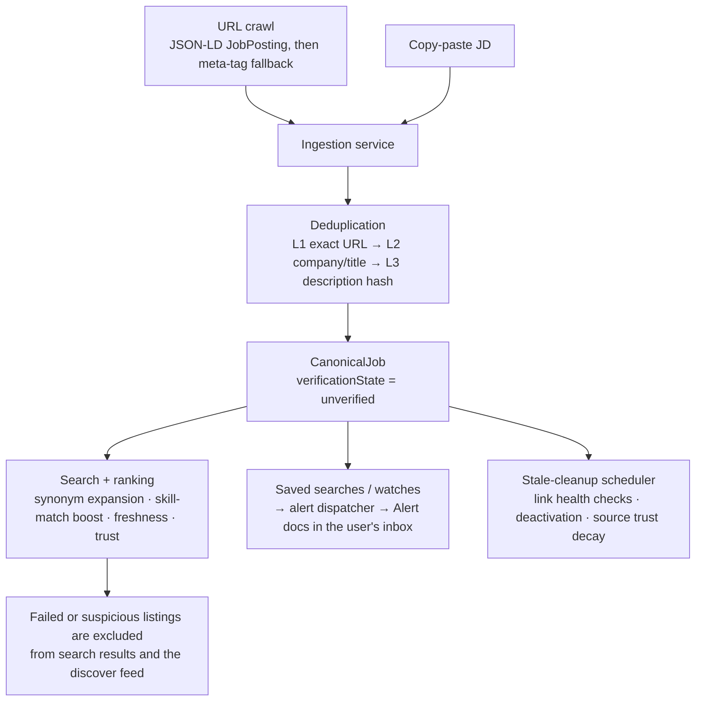

# System Design Document — JobTailor

|                      |                                                                  |
| -------------------- | ---------------------------------------------------------------- |
| **Document version** | 1.0                                                              |
| **Date**             | 2026-08-30                                                       |
| **Status**           | Draft                                                            |
| **Author**           | JobTailor project owner (sole developer)                         |
| **Project status**   | Advanced MVP — core workflows functional end-to-end              |
| **Repository state** | All claims below verified against the codebase at the date above |
| **Reviewers**        | None yet — draft for review                                      |

## Table of Contents

1. Introduction
2. Project Overview
3. Goals and Non-Goals
4. System Architecture
5. Data Design
6. API Design
7. Subsystem Design
8. Security Design
9. Infrastructure and Deployment
10. Scalability and Performance
11. Reliability, Edge Cases, and Failure Modes
12. Trade-offs and Decisions
13. Constraints That Shaped the Design
14. Known Limitations and Technical Debt
15. Open Questions and Future Considerations
16. Appendix

---

## 1. Introduction

### 1.1 Purpose

This document describes the architecture, data model, API surface, and design decisions of JobTailor, a personal job-application workspace. It documents the system as it exists in the repository today, including known limitations and technical debt. It is not a proposal; where work is planned rather than implemented, that is stated explicitly.

### 1.2 Scope

Covered: the Express API server, the React single-page client, the MongoDB data model, the AI provider abstraction, the job search/ingestion pipeline, authentication and session handling, security controls, deployment configuration, and failure behavior.

Not covered: detailed UI component design (covered separately in `UI_UX_ANALYSIS.md` and `AWKWARD_UI_PATTERNS.md` in the repository root), and third-party service internals (OpenAI, Gemini, NVIDIA NIM, Cloudinary, SMTP providers).

### 1.3 Audience

Software engineers maintaining or extending the system, and technical reviewers evaluating the design. The document assumes familiarity with REST APIs, JWT authentication, and the MERN-style stack.

### 1.4 Definitions

| Term             | Meaning                                                                                                              |
| ---------------- | -------------------------------------------------------------------------------------------------------------------- |
| JD               | Job description — the raw posting text for a role                                                                    |
| Master profile   | The user's canonical resume data: skills, experience, projects, education, certifications                            |
| Tailored resume  | A per-job snapshot of the master profile, reordered and rewritten to match one JD                                    |
| ATS score        | A heuristic 0–100 match score between a tailored resume and a parsed JD                                              |
| Canonical job    | A deduplicated job listing in the shared search index (`CanonicalJob`), distinct from a user's personal `Job` record |
| Provider manager | The single routing point for all LLM calls, with per-vendor adapters and fallback                                    |

---

## 2. Project Overview

### 2.1 Problem and context

JobTailor is a personal project built to support one workflow: applying to many jobs per day without losing track of any of them. For each role, the user needs to read the JD, adjust the resume to match, score how well it matches, submit, and later track what happened. Done manually in documents and spreadsheets, this does not scale past a handful of applications per day.

The implemented workflow loop:

```text
Build master profile → find/paste a job → parse the JD with an LLM
→ generate a tailored resume from the profile → view ATS score and gaps
→ export PDF → create an application record → track status, reminders, outcome
→ review aggregate analytics
```

### 2.2 Current status

The system is an advanced MVP. Verified at the time of writing:

- `npm run typecheck`, `npm run build`, and the Vitest suites pass in CI.
- The resume-tailoring loop, application tracker, job search engine, profile management, and session handling work end-to-end.
- Test suites cover auth, jobs, resumes, profile workflow, application workflow, the search engine, security utilities, AI provider adapters/manager, and client smoke tests.

What is honestly not finished: ATS scoring is a heuristic rather than a true ATS simulator, resume skill-relevance ordering is basic, analytics lack time-series and cohort views, and production deployment has configuration but has not been verified end-to-end. Details in §14.

### 2.3 Origin and ownership

JobTailor is an independent personal project, developed solo, licensed MIT. There is no employer or client involvement. All documentation, including this one, describes work actually performed in this repository.

---

## 3. Goals and Non-Goals

### 3.1 Goals (what the system does)

1. Store one master profile and derive per-job tailored resumes from it.
2. Parse free-text JDs into structured requirements using an LLM, with a vendor-neutral provider layer.
3. Produce a defensible match score with a per-skill breakdown (matched / missing / weak) and concrete action items.
4. Discover jobs through a first-party pipeline: URL crawling and copy-paste ingestion, multi-level deduplication, ranking, saved searches, watches, and alerts — without paid aggregator APIs.
5. Track each application through a status pipeline with timeline events, reminders, and outcomes.
6. Export the tailored resume as PDF.
7. Protect accounts with per-device sessions, refresh-token rotation, account lockout, and an audit log.

### 3.2 Non-goals (explicitly out of scope)

- Auto-apply bots.
- LinkedIn/Indeed scraping (access-limit and ToS risk; deliberately excluded).
- Interview preparation content generation, salary negotiation tooling.
- Team, multi-tenant, or enterprise features.
- Replicating real commercial ATS parsing engines — the score is a heuristic aid, stated as such in the UI and in this document.

---

## 4. System Architecture

### 4.1 High-level view



### 4.2 Component breakdown

| Component               | Responsibility                                                                                                       | Technology                                                                                   |
| ----------------------- | -------------------------------------------------------------------------------------------------------------------- | -------------------------------------------------------------------------------------------- |
| `apps/client`           | SPA: auth pages, dashboard, profile editor, jobs/search UI, resume tailor, Kanban tracker, analytics, interview mode | React 19, Vite 7, TypeScript 5.8, TailwindCSS, Zustand (auth), TanStack Query (server state) |
| `apps/server`           | REST API, business services, scheduled cleanup job                                                                   | Node.js ≥ 18 (CI runs Node 22), Express 5, TypeScript, Mongoose 8, Zod 4, Pino               |
| `packages/shared-types` | TypeScript contracts shared by client and server (e.g., alert and service contracts)                                 | TypeScript                                                                                   |
| MongoDB                 | The only persistence store: users, profiles, jobs, resumes, applications, search index, logs                         | MongoDB (local `mongo:7` via Docker, or Atlas connection string)                             |
| AI provider layer       | All LLM calls: JD parsing, summary rewrite, semantic ATS scoring, resume parsing                                     | Adapter pattern over OpenAI, Google Gemini, NVIDIA NIM                                       |
| PDF service             | Renders resume HTML to PDF with a pooled Puppeteer browser                                                           | Puppeteer                                                                                    |
| Cloudinary              | Stores generated PDFs and user-uploaded resume files                                                                 | Cloudinary SDK (optional; PDF falls back to data URL when unconfigured)                      |
| SMTP                    | Email verification, password reset                                                                                   | nodemailer against any SMTP provider; console-logging fallback in development                |

### 4.3 Architecture pattern and rationale

The system is a two-tier monolith: one SPA and one API server, sharing a single database. Inside the server, code is layered by domain: `routes` (HTTP concerns, rate limiters, Zod schemas) → `controllers` (request/response mapping) → `services` (business logic) → `models` (Mongoose schemas). Business services never call vendor SDKs directly; AI calls go through the provider manager, and file storage goes through the PDF/upload services.

Why this shape: it is a single-user-scale personal project. A monorepo with shared types keeps the client and server contracts in one place with one build pipeline (Turborepo), and a single API server keeps deployment and operations simple. The layered separation exists so that the parts most likely to change — LLM vendors, file storage — can change without touching business logic. No microservices, message queues, or caches are used; at personal scale they would add operational cost without a workload to justify them.

---

## 5. Data Design

### 5.1 Storage selection

MongoDB is the only datastore. There is no separate cache or search engine; search is served from the `CanonicalJob` collection with in-application ranking (§7.4).

The reason is data shape: resumes, parsed JDs, and profiles are heterogeneous, deeply nested documents that vary per user and per job, and the dominant access pattern is "fetch everything belonging to one user." Relational alternatives were not formally evaluated; the document model fit the content without impedance mismatch, and one datastore keeps local development and deployment simple.

### 5.2 Key collections

Core domain collections (all scoped by `userId`; compound indexes on `userId` + the dominant query field):

| Collection    | Key fields                                                                                                                                                                           | Notes                                                                                               |
| ------------- | ------------------------------------------------------------------------------------------------------------------------------------------------------------------------------------ | --------------------------------------------------------------------------------------------------- |
| `User`        | email, passwordHash (`select: false`), role, emailVerified, loginAttempts/lockUntil, hashed reset/verification tokens (sparse indexes), `activeSessions[]`                           | Sessions stored per device: sessionId, refreshTokenHash, userAgent, IP, fingerprintHash, lastUsedAt |
| `Profile`     | summary, skills (with years/proficiency), experience (with tagged bullets), projects, education, certifications                                                                      | One per user; the master resume source                                                              |
| `Job`         | jobTitle (only required field), companyName, jdRawText, `parsedJD` (summary, seniority, focusWeights, required/preferred skills, responsibilities…), attachedResumeId, status, notes | Personal jobs. Created with minimal fields; everything else can be filled later                     |
| `Resume`      | version/versionLabel, tailoredSummary, skills, experience, projects, `atsScore`, pdfUrl, isProfileResume, status                                                                     | Snapshot of profile content at generation time, not a reference — see §12                           |
| `Application` | jobId, resumeId, status enum (`saved → applied → screening → interview → offer/rejected/withdrawn`), previousStatus[], timelineEvents[], reminders[], outcome fields                 | Unique compound index `(userId, jobId)` prevents duplicate applications per job                     |

Search-pipeline collections:

| Collection                            | Role                                                                                                                                                      |
| ------------------------------------- | --------------------------------------------------------------------------------------------------------------------------------------------------------- |
| `CanonicalJob`                        | Deduplicated index of ingested listings, with `verificationState` (`unverified/verified/failed/suspicious`), source reference, first/last seen timestamps |
| `SourceRegistry`                      | Registered crawl sources with trust scores                                                                                                                |
| `SavedSearch`, `Watch`, `Alert`       | Saved queries, company/title watches, and dispatched alert records with read state                                                                        |
| `SearchQueryLog`, `JobInteractionLog` | Query and interaction telemetry feeding the quality dashboard                                                                                             |
| `AuditLog`                            | Security-relevant events (logins, token events, admin actions)                                                                                            |

Design notes worth knowing before modifying the schema:

- `Resume` deliberately snapshots profile content. Editing the master profile after generation must not silently rewrite already-exported resumes.
- `Job.status` duplicates `Application.status`. The canonical pipeline now lives on `Application`; the field remains on `Job` for backward compatibility and is a candidate for removal (§14).
- Analytics derive interview/offer rates from `Application.status`, not from the legacy `callbackReceived` flag.

### 5.3 Data flow — resume tailoring loop

1. Client calls `POST /jobs` with pasted JD text (or attaches a previously ingested listing); a `Job` document is created with no parsed JD content.
2. `POST /jobs/:id/parse` sends the raw JD to the provider manager, which routes to the preferred configured LLM (falling back on failure). The structured result — summary, seniority, focus weights, required/preferred skills, responsibilities, qualifications, tone — is validated and stored on the job.
3. `POST /resumes/generate` snapshots the user's profile, reorders skills toward JD requirements, prioritizes experience bullets by JD focus tags, selects projects by skill overlap, and optionally rewrites the summary through the LLM.
4. The ATS scoring pipeline (§7.3) runs and the complete `Resume` document — content plus score breakdown — is persisted and returned.
5. `POST /resumes/:id/pdf` renders the resume to PDF via the Puppeteer pool; the file is uploaded to Cloudinary when configured, otherwise returned for direct download.
6. `POST /applications` links `jobId` + `resumeId` into the tracker. Status changes append timeline events; outcomes (callback, rejection reason, offer amount) are recorded on the same document.

### 5.4 Data flow — job search pipeline



---

## 6. API Design

### 6.1 Conventions

Base path `/api/v1`. All authenticated endpoints take a `Bearer` access token. Uniform response envelope:

```json
// success
{ "success": true, "data": { } }

// error
{ "success": false, "error": { "code": "ERROR_CODE", "message": "…", "details": [] } }
```

Rate limiting is applied globally on `/api/` (100 requests per 15 minutes in production, 500 otherwise) with stricter limiters on sensitive auth endpoints (§8).

### 6.2 Implemented endpoint groups

| Domain       | Endpoints                                                                                                                                                                    | Notes                                                 |
| ------------ | ---------------------------------------------------------------------------------------------------------------------------------------------------------------------------- | ----------------------------------------------------- |
| Auth         | register, verify-email, resend-verification, login, refresh, me, logout, logout-all, forgot-password, reset-password, change-password                                        | Refresh rotates the token and its stored session hash |
| Profile      | GET/PUT profile; CRUD for skills, experience, projects, education, certifications; resume upload + AI parse                                                                  | Completeness computed client-side from returned data  |
| Jobs         | CRUD; `POST /jobs/:id/parse`; `PATCH /jobs/:id/attach-resume`                                                                                                                | Flexible creation — only title required               |
| Resumes      | generate, list (optional jobId filter), get, update, `GET /resumes/reuse`, `POST /resumes/:id/pdf`                                                                           | PDF endpoint wired in Sprint 5                        |
| Applications | create, list, get (populated job/resume), status patch, notes, reminders + reminder completion, outcome patch, delete                                                        | Unique per (user, job)                                |
| Analytics    | overview, status-breakdown, skill-gap-report, resume-performance                                                                                                             | Rates derived from application statuses               |
| Search       | search, ingest (URL or pasted text), saved-search CRUD, watches CRUD, alerts list/mark-read/mark-all-read, discover feed, sources registration, manual health check, cleanup | All behind auth                                       |

The route-level source of truth is `apps/server/src/routes/`. `docs/api-reference.md` predates several endpoints (application creation, PDF export, outcomes) and should be read with care.

### 6.3 Worked example (job creation)

Verified against `job.controller.ts`: only `jobTitle` is required; every other field is optional and receives a default (`workType: remote`, `employmentType: full-time`, `status: saved`).

```json
// POST /api/v1/jobs  (authenticated)
// Request
{
  "jobTitle": "Frontend Engineer",
  "companyName": "Example GmbH",
  "jobLink": "https://careers.example.com/frontend",
  "workType": "remote",
  "jdRawText": "We are looking for..."
}

// Response (201 Created)
{
  "success": true,
  "data": {
    "job": {
      "_id": "…",
      "jobTitle": "Frontend Engineer",
      "companyName": "Example GmbH",
      "workType": "remote",
      "employmentType": "full-time",
      "status": "saved"
      // …full Job document including userId and timestamps
    }
  }
}
```

The created job carries no parsed JD; parsing is a separate on-demand step (`POST /jobs/:id/parse`, flow in §5.3).

### 6.4 Error handling strategy

A single central error handler maps error types to responses:

| Condition                            | HTTP | Error code example                                     |
| ------------------------------------ | ---- | ------------------------------------------------------ |
| Zod validation failure               | 400  | Field-level `details` array                            |
| Missing/expired/invalid token        | 401  | `AUTH_MISSING_TOKEN`, `TOKEN_EXPIRED`, `TOKEN_INVALID` |
| Non-admin on admin route             | 403  | `FORBIDDEN`                                            |
| Unknown resource / cross-user access | 404  | `NOT_FOUND` (ownership checks never leak existence)    |
| Rate limited                         | 429  | `RATE_LIMITED`, `AUTH_RATE_LIMITED`                    |
| Mongoose validation/cast errors      | 400  | Mapped by the error handler                            |
| Unexpected failure                   | 500  | Logged with a request correlation ID (`X-Request-Id`)  |

The client treats `TOKEN_EXPIRED` specially: it attempts one silent refresh before surfacing the session-expired dialog (§7.1).

---

## 7. Subsystem Design

### 7.1 Authentication and sessions

Password auth with bcrypt hashing (12 rounds configured; 10 in Docker dev). Access tokens are short-lived JWTs (default 15 min); refresh tokens live 7 days.

Design decisions made during hardening work:

- **Per-device sessions.** Every login creates a session entry on the user document: session ID, hashed refresh token, user agent, IP, and an optional client fingerprint hash. `POST /auth/logout` revokes one session; `POST /auth/logout-all` revokes all. Refresh rotates the token: the old hash is replaced, so a stolen pre-rotation refresh token stops working.
- **Hashed tokens at rest.** Refresh, password-reset, and email-verification tokens are stored as hashes with sparse indexes, so a database leak does not expose usable tokens.
- **Lockout and throttling.** Failed logins increment `loginAttempts` and can set `lockUntil`. Login and forgot-password endpoints allow 5 requests per 15 minutes per IP; other auth endpoints allow 20. The app sets `trust proxy 1` so rate limits and audit attribution use the real client IP behind Render/Vercel proxies.
- **Audit log.** Security-relevant events are persisted in `AuditLog`.

Client side: Zustand holds the session; TanStack Query holds server data. The refresh token travels as an HttpOnly cookie set by the server. On `TOKEN_EXPIRED`, the API wrapper retries once after a silent refresh; if refresh fails, a `SessionExpiredModal` overlay takes over so the user does not lose unsaved form input mid-screen.

### 7.2 AI provider abstraction

All LLM usage goes through one contract with two methods: `generateCompletion(prompt, systemPrompt, options)` and `generateStructuredOutput<T>(prompt, systemPrompt, schema, options)`. Business services call the provider manager singleton, never a vendor SDK.

Adapters exist for OpenAI (GPT-4o-mini), Google Gemini (1.5 Flash), and NVIDIA NIM (OpenAI-compatible endpoint). On startup the manager registers adapters whose credentials are present and non-placeholder, and builds a fallback order: preferred provider first, then `openai → gemini → nvidia`. A call failure on one provider logs a warning and retries on the next; if all fail, the error includes each provider's failure reason.

Why this exists: the system was developed against free/low-cost tiers where any single provider can hit quota or outage at any time, and I did not want business logic coupled to one vendor's SDK shape. The cost is a small abstraction layer and per-adapter response-mapping code; the benefit is that adding a provider is an adapter + config + registration, with no service-layer changes. An extension checklist is documented in `docs/ai-provider-architecture.md`.

### 7.3 JD parsing and ATS scoring

**JD parsing** asks the LLM for structured JSON conforming to the `IParsedJD` shape (summary, seniority, focus weights, required/preferred skills, responsibilities, qualifications, nice-to-haves, tone). Output is sanitized before storage; parsing is on-demand via `POST /jobs/:id/parse`, not automatic on job creation.

**ATS scoring** combines four phases with fixed weights:

| Phase                | Weight | Method                                                                                           |
| -------------------- | ------ | ------------------------------------------------------------------------------------------------ |
| Keyword match        | 35%    | Weighted token matching of JD skills against resume text; required skills weigh 2×, preferred 1× |
| Semantic match       | 45%    | LLM evaluation via provider manager                                                              |
| Section completeness | 12%    | Points for presence/depth of skills, experience bullets, projects, education                     |
| Format quality       | 8%     | Base content score plus quantified bullets (`\d+%`, `$…`, counts) and bullet density             |

Failure behavior is deliberate: if the LLM phase fails, the score is **renormalized over the three deterministic phases** (55/25/20), flagged `semanticScoreDegraded`, and the action items tell the user the AI phase was missing. A degraded score is never backfilled with a fabricated semantic value. This matters because the score influences user decisions; presenting a confident-but-fake number would be worse than an honest partial one.

Limitation, stated plainly: this is a useful heuristic, not a simulation of any commercial ATS. Keyword matching is token-based without true TF-IDF, and the weak-skill heuristic uses a static seniority-to-years table.

### 7.4 Job search engine

Built first-party specifically to avoid paid aggregator APIs and ToS-restricted scraping. Pipeline:

1. **Ingestion.** Two paths share one contract: a URL crawler (fetches the page, prefers JSON-LD `JobPosting`, falls back to meta tags) and manual paste. All crawled URLs pass an SSRF guard (`url-guard.ts`) that blocks private/internal address ranges.
2. **Deduplication.** Three levels: exact URL, normalized company+title, then description text-hash similarity. Duplicates collapse into the existing `CanonicalJob`.
3. **Ranking.** MongoDB filters first (keyword regex with synonym expansion, location, work type, employment type, salary, freshness, source), then an in-memory deterministic scoring pass over at most the 500 newest candidates: exact title/company matches, source trust, freshness, and profile-skill overlap boosts. The cap bounds cost at O(500) per query instead of O(collection); the trade-off is accepted at current data sizes (§12).
4. **Verification and freshness.** Each canonical job carries `verificationState`. Async link health checks mark listings failed/suspicious; failed and suspicious jobs are excluded from search and feeds, and repeated failures decay the source's trust score. A scheduled cleanup job (started with the server, stopped on shutdown) deactivates stale listings.
5. **Personalization layer.** Saved searches, company/title watches, and an alert dispatcher create `Alert` documents surfaced in an inbox UI with read/unread and mark-all-read lifecycle. A discover feed combines profile skills and watches while excluding jobs already in the user's tracker. `SearchQueryLog` and `JobInteractionLog` feed the quality dashboard (source trust audit, verification breakdown, query metrics).

### 7.5 PDF generation and file storage

The PDF service keeps a pooled Puppeteer browser instance (opened lazily, closed during graceful shutdown) and renders the resume's HTML template to PDF. When Cloudinary credentials are configured, the PDF and user-uploaded resume files are stored there and the URL is persisted on the resume; otherwise the PDF is returned as a data URL for direct download. Cloudinary is treated as the only supported file store — local-disk resume storage was removed after an earlier iteration left stray files in the repository.

### 7.6 Background processing

One scheduled job runs in-process with the server: stale-listing cleanup and link health checks. There is no queue or worker tier. The choice was in-process scheduling because the workload (periodic checks over one user's index) does not justify separate infrastructure. If ingestion volume grows, this is the first component that should move out of the API process.

---

## 8. Security Design

Controls implemented, mapped to concerns:

| Concern            | Implementation                                                                                                                                     |
| ------------------ | -------------------------------------------------------------------------------------------------------------------------------------------------- |
| Credential storage | bcrypt password hashes (`select: false`); refresh/reset/verification tokens stored hashed                                                          |
| Transport/session  | Short-lived access JWT + rotating refresh token in HttpOnly cookie; per-device session revocation                                                  |
| Brute force        | Per-endpoint auth rate limits (5/15 min on login and forgot-password), account lockout via `loginAttempts`/`lockUntil`                             |
| Injection          | Zod validation on every write endpoint; user input never interpolated into raw regex without escaping (search); parameterized queries via Mongoose |
| SSRF               | URL guard validates crawl targets against private/internal ranges before fetch                                                                     |
| XSS                | Output escaping (`escape-html`) for LLM-derived and user content rendered in generated HTML; client-side guards on rendered content                |
| Mass assignment    | Route-level schema whitelists; update endpoints accept only declared fields                                                                        |
| Authorization      | Ownership checks on every user-scoped query (`userId` filter); `requireAdmin` guard for admin routes                                               |
| Headers            | Helmet defaults; CORS restricted to a configured origin allowlist with credentials                                                                 |
| Secrets            | Environment variables only; `.env.example` ships placeholders; `gitleaks.toml` config in repo                                                      |
| Observability      | Pino structured logs with request correlation IDs; `AuditLog` collection for security events                                                       |
| Supply chain       | CI runs lint/typecheck/build/tests on every PR; commit hooks (husky + commitlint); gitleaks config for secret scanning                             |

Honest assessment: this is defense-in-depth appropriate for a personal-scale app. No formal penetration test has been performed, and there is no compliance regime (GDPR/PCI/SOC 2) because there are no third-party users or regulated data.

---

## 9. Infrastructure and Deployment

### 9.1 Environments

| Environment       | Purpose          | How it runs                                                                                                                                                                                                                                              |
| ----------------- | ---------------- | -------------------------------------------------------------------------------------------------------------------------------------------------------------------------------------------------------------------------------------------------------- |
| Local development | Day-to-day work  | `npm run dev` (Turborepo) with MongoDB via Docker Compose or Atlas; client at `localhost:5173`, API at `localhost:5000`                                                                                                                                  |
| CI                | Verification     | GitHub Actions: typecheck → lint → build → all-workspace tests (server, client, and extension suites via root `npm run test`) → server coverage floor, with CI-only dummy JWT secrets; no database service container (tests use `mongodb-memory-server`) |
| Production        | Intended hosting | Configuration written, not yet verified end-to-end (§14)                                                                                                                                                                                                 |

`docker-compose.yml` defines `mongo:7` (with healthcheck and a persistent volume), the server built from `apps/server/Dockerfile`, and an optional client container.

### 9.2 Deployment configuration

- **Server:** `render.yaml` targets a Render free-tier web service, single instance, health check at `/health`, manual deploy only ("deploy after CI is green"), with a 1 GB disk mounted at the Puppeteer cache path — headless Chrome needs persistent disk.
- **Client:** static Vite build intended for Vercel (config present).
- **Database:** MongoDB Atlas connection string via `MONGODB_URI`.

### 9.3 Configuration groups (`.env`)

MongoDB URI; two JWT secrets plus expiry settings and bcrypt rounds; CORS origin; AI provider keys + `PREFERRED_AI_PROVIDER` + NVIDIA base URL/model; Cloudinary credentials and folder; SMTP host/port/user/pass and sender identity; `FRONTEND_URL` for email links. The server validates configuration at startup (`validateConfig()`) and fails fast on missing required values. Docker Compose uses `:?` expansion so missing secrets abort startup rather than boot silently misconfigured.

### 9.4 Operational behavior

Graceful shutdown on SIGTERM/SIGINT: close the Puppeteer browser, stop accepting connections, disconnect MongoDB. `/health` returns uptime and is excluded from request logging to avoid log noise. There is no metrics/alerting stack; Pino logs are the operational signal. Not measured: latency, throughput, and uptime — no load testing has been performed.

---

## 10. Scalability and Performance

### 10.1 How the system is sized today

JobTailor is sized for a single active user. The deployment configuration runs one server instance (`numInstances: 1` in `render.yaml`); there is no horizontal scaling, load balancer, or database replica. All collections are scoped by `userId` with compound indexes over the dominant query patterns (`userId` + status, `userId` + savedAt, `userId` + jobId), so per-user data growth is the axis that matters.

### 10.2 Operations with bounded cost

- Search ranking scores at most the 500 newest candidates in memory per query instead of the whole collection (§12).
- PDF rendering reuses a pooled Puppeteer browser instead of launching Chromium per request; the pool is closed during graceful shutdown.
- The global rate limiter (100 requests per 15 minutes per IP in production) bounds inbound request volume.
- JD parsing and resume generation are network-bound on LLM calls (expected, not measured); the four ATS scoring phases run in parallel via `Promise.all`.

### 10.3 Performance targets

Not measured. No load testing, benchmarking, or latency profiling has been performed, and no uptime SLA is defined — there is no production traffic to measure. If measurement is added, the first candidates are resume-generation latency (LLM-bound) and PDF render time (the heaviest local operation).

### 10.4 First scaling moves, if usage ever grows

In rough order: move search ranking to a real search index once the canonical corpus outgrows the candidate cap; move the cleanup scheduler out of the API process; then consider a second API instance. One real constraint on that last step: `express-rate-limit` currently uses its in-memory store, so multi-instance deployment would split rate-limit counters per instance and would need shared storage first.

---

## 11. Reliability, Edge Cases, and Failure Modes

Behaviors below are implemented, not aspirational:

| Failure                                     | Detection                                          | System behavior                                                                                                    | Recovery                                                             |
| ------------------------------------------- | -------------------------------------------------- | ------------------------------------------------------------------------------------------------------------------ | -------------------------------------------------------------------- |
| Preferred LLM provider fails                | Adapter exception                                  | Warning logged; next provider in fallback order tried                                                              | Automatic. If all fail, the request errors with per-provider reasons |
| LLM fails during ATS scoring                | Semantic phase returns null                        | Score renormalized over deterministic phases; `semanticScoreDegraded` flagged; user-facing action item explains it | Automatic, honest degradation — no fabricated score                  |
| Malformed LLM output                        | Schema validation on parsed JD / structured output | Request fails cleanly; nothing partial persisted                                                                   | User retries parse                                                   |
| Access token expired                        | `TOKEN_EXPIRED` from API                           | Client attempts silent refresh once; on failure, session-expired overlay preserves unsaved input                   | Automatic refresh, else re-login                                     |
| Refresh token reuse after rotation          | Stored hash mismatch                               | Refresh rejected                                                                                                   | User re-authenticates                                                |
| Credential stuffing                         | Rate limit + `loginAttempts`                       | 429, then account lock window                                                                                      | Lockout expires; password reset available                            |
| Crawl target returns 4xx/5xx or bad content | Fetch/parser failure                               | `verificationState` moves toward failed/suspicious; excluded from index; source trust decays                       | Re-check by scheduler or manual check trigger                        |
| Duplicate ingestion                         | L1/L2/L3 dedup                                     | Collapses into existing canonical job                                                                              | Not needed                                                           |
| Stale listing                               | `lastSeenAt` age + link check                      | Deactivated by cleanup scheduler                                                                                   | Not served in search while inactive                                  |
| Cloudinary unconfigured                     | Missing config                                     | PDF returned as data URL instead of persisted                                                                      | Manual: configure Cloudinary                                         |
| SMTP unconfigured                           | Missing config                                     | Emails logged to console (development mode)                                                                        | Manual: configure SMTP                                               |
| MongoDB unavailable                         | Connection error                                   | API operations fail; server does not serve data                                                                    | Manual: restore database                                             |
| Process restart with PDF browser open       | Shutdown hook                                      | Browser closed, DB disconnected cleanly                                                                            | Automatic                                                            |

Edge cases handled in validation: empty/oversized bodies (10 MB limit), missing optional JD at job creation, cross-user resource access (404, not 403, to avoid existence leaks), disabled accounts rejected at the auth middleware even with a valid token.

---

## 12. Trade-offs and Decisions

| Decision           | What was chosen                                                                  | Trade-off                                                                                                                                                        |
| ------------------ | -------------------------------------------------------------------------------- | ---------------------------------------------------------------------------------------------------------------------------------------------------------------- |
| AI integration     | Provider-manager abstraction with per-vendor adapters and config-driven fallback | Extra layer + per-adapter mapping code; buys vendor independence and outage tolerance on free tiers                                                              |
| ATS semantic phase | LLM score at 45% weight, with deterministic-only fallback                        | Score quality depends on provider availability; degraded mode is visibly weaker but honest                                                                       |
| Search ranking     | In-memory scoring capped at 500 newest candidates over MongoDB filters           | Bounded query cost today; will not scale to a large corpus without a real search index. Alternative (MongoDB Atlas Search or Elasticsearch) was not evaluated    |
| Resume storage     | Snapshot of profile content into each `Resume`                                   | Duplicated data per resume; buys immutability of exported resumes against later profile edits                                                                    |
| Job discovery      | First-party crawl + paste pipeline                                               | No paid API costs and full control over dedup/ranking; coverage is limited to what is crawled or pasted — no board-wide reach                                    |
| Session model      | Stateless access JWT + server-side refresh session records                       | Every authenticated request does one user lookup; revocation and per-device logout become possible, which pure stateless JWT cannot do                           |
| Persistence        | MongoDB only                                                                     | No relational integrity across collections; acceptable because user-scoped documents are the unit of access. Relational alternatives were not formally evaluated |
| Background work    | In-process scheduler                                                             | Couples cleanup lifetime to the API process; fine at current scale, wrong at high ingestion volume                                                               |
| File storage       | Cloudinary-only for generated/uploaded files                                     | External dependency; eliminates local-disk sprawl that an earlier local-storage iteration caused                                                                 |

---

## 13. Constraints That Shaped the Design

These actually constrained the work:

- **Solo development and personal-scale usage.** Everything is sized for one active user; no multi-instance or horizontal-scaling design exists.
- **Free and low-cost tiers only.** Render free tier (hence single instance, hence the Puppeteer disk mount), free-tier AI quotas (hence provider fallback), no paid job-board APIs (hence the first-party search pipeline).
- **Provider volatility.** Free LLM quotas run out mid-session; the fallback chain and degraded scoring mode exist because of this.
- **ToS/access limits of major boards.** LinkedIn/Indeed are excluded by design, which bounds the discovery feature set.
- **LLM output unreliability.** Structured-output validation, sanitization of parsed JD text, and the no-fabrication rule in scoring all respond to observed malformed or missing model output.

---

## 14. Known Limitations and Technical Debt

Documenting what IS, not what should be:

1. **ATS scoring is heuristic.** No true TF-IDF, no real ATS engine emulation. The honest internal estimate for this area is ~60% complete.
2. **`Job.status` duplicates `Application.status`.** Kept for backward compatibility; the tracker pipeline is canonical on `Application`.
3. **Resume skill ordering is shallow.** Highlighted-first plus focus-tag priority; no deep JD-relevance weighting.
4. **Analytics are aggregate-only.** No time-series or cohort views.
5. **Ranking does not scale past a small corpus** due to the in-memory candidate cap.
6. **Older docs lag the code.** `docs/architecture.md` (2026-05-14) and `docs/api-reference.md` predate the search engine, sessions, PDF route, and outcome endpoints. This document supersedes them where they conflict.
7. **Production deployment is configured but unverified end-to-end.** Render/Vercel/Atlas wiring has not been exercised against live traffic; there are zero production metrics because there is no production usage.
8. **One large client page.** `JobsPage.tsx` has grown past 3,000 lines and needs decomposition.

---

## 15. Open Questions and Future Considerations

**Open questions:**

- When (whether) to move ranking to a proper search index — depends on corpus growth, which is uncertain for a personal tool.
- Whether to remove `Job.status` outright after a data migration, or leave it dormant.
- Whether reminder due-dates deserve push/email notification, which would require a notification provider decision.

**Future considerations (not committed):**

- Email digests for saved-search alerts (the alert dispatcher currently writes in-app alerts only).
- Deeper semantic evaluation for ATS (embedding similarity) once provider costs are predictable.
- Decomposition of the jobs page and extraction of shared UI primitives.

---

## 16. Appendix

### 16.1 Verification commands

```bash
npm install
npm run typecheck
npm run lint
npm run build
npm run test                    # server + client Vitest suites
docker compose up               # local MongoDB + server + optional client
```

### 16.2 Repository documents referenced

| Document                                                            | Content                                                           |
| ------------------------------------------------------------------- | ----------------------------------------------------------------- |
| `docs/architecture.md`                                              | Earlier architecture snapshot (2026-05-14) — partially superseded |
| `docs/ai-provider-architecture.md` + `ai-provider-configuration.md` | Provider contract and configuration guide                         |
| `docs/advanced-job-search-engine.md`                                | Full search-engine design plan and sprint breakdown               |
| `docs/sprint-{1..5}-checklist.md`                                   | Executed sprint checklists with verification notes                |
| `MVP_STATUS.md`                                                     | Current completion matrix per feature area                        |
| `docs/api-reference.md`                                             | Endpoint reference (partially superseded, see §6.2)               |

### 16.3 Revision history

| Version | Date       | Change                                                      |
| ------- | ---------- | ----------------------------------------------------------- |
| 1.0     | 2026-08-30 | Initial document, written from direct codebase verification |
